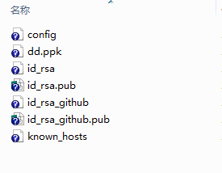

#[ssh](http://www.ruanyifeng.com/blog/2011/12/ssh_remote_login.html) 生成 多个ssh Key

##1、生成到默认位置

ssh-keygen -t rsa -C "your@email"

##2、生成到指定文件夹

-f : 表示生成公钥/私钥的路径

ssh-keygen -t rsa -C "your@emailcompany" -f ~/.ssh/id_rsa

ssh-keygen -t rsa -C "your@emailpersonal" -f ~/.ssh/id_rsa_github

##3、git（github、gitlab等）服务器设置SSH Key

##4、设置私钥代理

ssh-add ~/.ssh/id_rsa_github

显示私钥列表

$ ssh-add -l   

清空私钥列表

$ ssh-add -D  

###注意

如果执行ssh-add时提示”Could not open a connection to your authentication agent”，可以先执行以下命令

ssh-agent bash

##5、在.ssh目录下添加config文件

company

Host gitlab

HostName 192.168.1.1

User ouyangjun

IdentityFile ~/.ssh/id_rsa

github

Host github

HostName github.com

User ouyangjun

IdentityFile ~/.ssh/id_rsa_github

##6、测试

ssh -T git@github.com

##参考：

[http://blog.csdn.net/czhpxl007/article/details/50466087](http://blog.csdn.net/czhpxl007/article/details/50466087)

[http://blog.itpub.net/25851087/viewspace-1262468/](http://blog.itpub.net/25851087/viewspace-1262468/)

[http://www.cnblogs.com/popfisher/p/5731232.html](http://www.cnblogs.com/popfisher/p/5731232.html)
