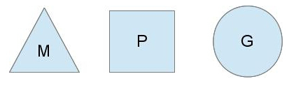

# Golang常见问题

## Golang中出了加Mutex锁之外还有哪些方式安全读写共享变量

1、atomic包提供了原子性内存原语  
2、可以使用channel在go协程中安全读写共享变量  

## 无缓冲chan的发送和接收是否同步

```golang
ch := make(chan int) // 无缓冲的channel由于没有缓冲发送和接收需要同步
ch := make(chan int, 2) // 有缓冲channel不要求发送和操作同步
```

channel无缓冲时：发送阻塞直到数据被接收，接收阻塞直到读到数据  
channel有缓冲时：当缓冲满时发送阻塞，当缓冲空时接收阻塞  

## Golang并发机制以及它所使用的CSP并发模型

### CSP

通信顺序过程（CSP）是一种描述并发系统中交互模式的正式语言，它是并发数据理论家族中的一个成员，被称为过程算法，是基于消息的通道传递理论。

不同传统的多线程共享内存来通信，CPS讲究的是“以通信的方式来共享内存”；用于描述多个独立的并发实体通过共享的通讯管道（channel）进行通信的并发模型，CSP中channel是第一类对象，它不关注发送消息的实体，而关注与发送消息时使用的channel。

### golang中的应用

golang中channel是被单独创建并且可以在协程之间传递，两个实体同时监听一个管道，一个实体通过将消息发送到channel中，另一个实体监听到这个channel的消息则进行消费，两个实体之间是匿名，这个就实现实体中间的解耦；其中channel是同步的一个消息被发送到channel中，最终一定要被另外的实体消费掉。

Golang的CPS并发模型，是通过Goroutine和Channel来实现的  

Goroutine是Go语言中并发的执行单位，其实就是和传统概念上的“线程”类似；Channel是GO语言各个并发结构体的通信机制。

因此GPM的简要概括即为：事件循环、线程池、工作队列

## Goroutine

Goroutine是golang实际并发执行的实体，底层是使用协程（coroutine）实现并发，coroutine是一种运行在用户态的用户线程；
它具有如下特点：  
>1、使用用户空间，可以避免了内核态和用户态的切换的成本  
>2、可以由语言和框架层进行调度  
>3、占用更小的栈空间，允许创建大量的实体  

### golang中goroutine的特性

Golang内部有三个对象： P对象（processor）代表上下文或者可以认为是CPU，M对象（workthread）代表工作线程,G对象（goroutine）

正常情况下一个cpu对象开启一个工作线程对象，线程去检查并执行goroutine对象；碰到goroutine对象阻塞的时候，会开启一个新的工作线程，充分利用cpu资源，所以有时候线程对象会比处理器对象多很多.


G(Goroutine)：我们所说的协程，为用户及的轻量级线程，每个groutine对象中的sched保存着其上下文信息；  
M(Machine)：对OS内核级线程的封装  
P(Processor)：逻辑处理器，即为G和M的调度对象，用来调度G和M之间的关联关系，其数量为默认核心数

## golang中常用的并发模型

常用的并发模型有三种

### 通过channel通知实现并发控制

```golang
func channelConcurrency() {
 ch := make(chan struct{})

 go func() {
  log.Printf("start working")
  time.Sleep(time.Second * 3)
  ch <- struct{}{}
 }()

 <-ch
 log.Println("finished")
}
```

当主goroutine运行到 <-ch 接受 channel 的值的时候，如果该channel中没有数据，就会一直阻塞等待，直到有值;这样就可以简单实现并发控制。

### 通过sync包中的WaitGroup实现并发控制

```golang

// syncConcurrency
// 通过WaitGroup实现并发控制
func syncConcurrency() {
 var wg sync.WaitGroup

 for i := 0; i < 5; i++ {
  wg.Add(1)
  go func(i int) {
   defer wg.Done()
   log.Println(i)
  }(i)
 }
 wg.Wait()
 // time.Sleep(5 * time.Second)
 log.Println("finished ", runtime.NumGoroutine())
}
```

应用场景：需要同步等待

### 在Go 1.7以后引进的强大Context上下文，实现并发控制

```golang

func withContextConcurrency() {
 ctx, cancel := context.WithCancel(context.Background())

 go work(ctx, "one")
 go work(ctx, "two")
 go work(ctx, "three")
 // time.Sleep(2 * time.Second)
 log.Println("stop the goroutine")
 cancel()
 time.Sleep(time.Second * 2)
}

func work(ctx context.Context, name string) {
 for {
  select {
  case <-ctx.Done():
   log.Println(name, "one stop channel")
   return
  default:
   log.Println(name, "one still workinf")
   time.Sleep(100 * time.Millisecond)
  }
 }
}
```

应用场景：父子协程之间传递数据

## Go中对nil的Slice和空的Slice的处理是一致的吗？

nil slice和empty slice是不一致的

## Golang的内存模型中为什么小对象多了会造成GC压力

通常小对象过多会导致GC三色法消耗过多的GPU；优化思路是，减少对象分配。

## 数据竞争问题如何解决？

1、可以使用互斥锁sync.Mutex  
2、也可以通过CAS（原子操作）无锁并发解决  
3、使用channel管理数据  

### 竞争检测机制

```golang
go test -race main
go run -race main.go
go build -race main
```

## 什么是channel，为什么它可以做到线程安全？
