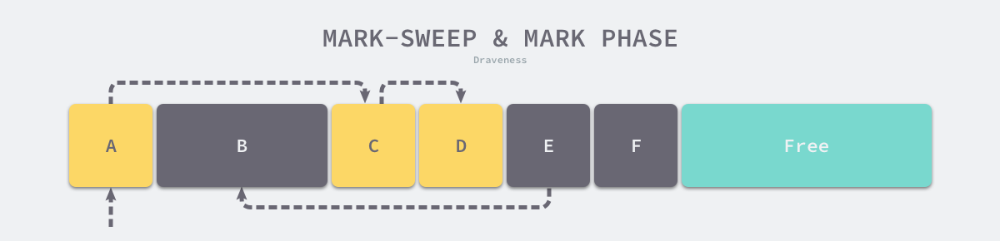

# 内存管理

## 垃圾回收

### 常见垃圾回收算法

|方法|定义|优点|缺点|适用范围|
|-----|-----|-----|-----|-----|
|引用计数|引用技术通过在对象上增加自己被引用的次数，被其他对象引用时增加1，引用自己的对象被回收时减1，引用数为0的对象即为可以被回收的对象；|1、方式简单、回收速度快|1、需要额外空间存放计数；2、无法处理循环引用；3、频繁更新引用计数降低性能|内存比较吃紧、实时性比较高php/python|
|标记-清除|标记：从根变量开始迭代，遍历所有被引用的对象，对能够通过应用遍历访问到的对象都进行标记为“被引用”清除：对没有标记的内存进行回收（回收可能伴有碎片整理操作）|1、节省空间|1、每次回收都会暂停当前所有正常代码执行，回收使系统响应能力降低|适用于垃圾比例较小的情况如java、golang|
|复制收集|需要对对象进行一次扫描，并准备一个“新的空间”，从根开始，对对象进行扫描，如果存在对这个对象的引用，就把它复制到“新的空间中”,一次扫描之后，所有存在于“新的空间”的对象就是所有的非垃圾对象|1、速度快 2、局部性|1、需要额外开辟空间|适用于垃圾比例较大的情况|

### 内存管理组件

下图中，用户程序（Mutator）会通过内存分配器（Allocator）在堆上申请内存，而垃圾收集器（Collector）负责回收堆上的内存空间，内存分配器和垃圾收集器共同管理着程序中的堆内存空间

### 标记清除

标记清除（Mark-Sweep）算法是最常见的垃圾收集算法，标记清除收集器是跟踪式垃圾收集器，其执行过程可以分成标记（Mark）和清除（Sweep）两个阶段：  

标记阶段 — 从根对象出发查找并标记堆中所有存活的对象；  
清除阶段 — 遍历堆中的全部对象，回收未被标记的垃圾对象并将回收的内存加入空闲链表；

如下图所示，内存空间中包含多个对象，我们从根对象出发依次遍历对象的子对象并将从根节点可达的对象都标记成存活状态，即 A、C 和 D 三个对象，剩余的 B、E 和 F 三个对象因为从根节点不可达，所以会被当做垃圾：

标记阶段结束后会进入清除阶段，在该阶段中收集器会依次遍历堆中的所有对象，释放其中没有被标记的 B、E 和 F 三个对象并将新的空闲内存空间以链表的结构串联起来，方便内存分配器的使用。

每次回收都会暂停当前所有正常代码执行，使系统响应能力降低,我们需要用到更复杂的机制来解决STW的问题。

## Golang的内存模型中为什么小对象多了会造成GC压力

通常小对象过多会导致GC三色法消耗过多的GPU；优化思路是，减少对象分配。
