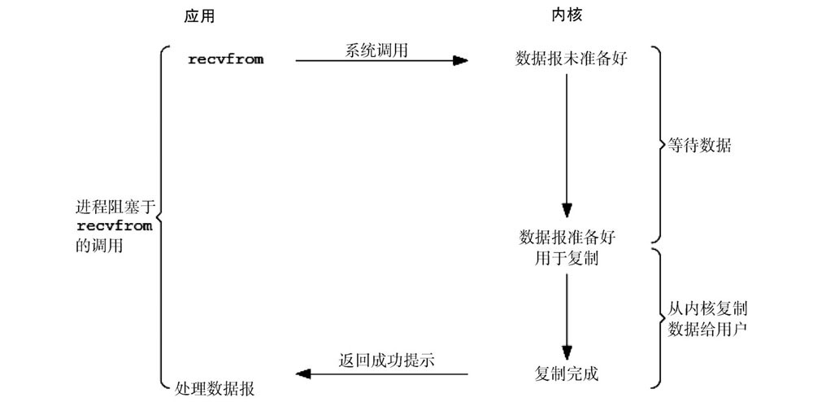
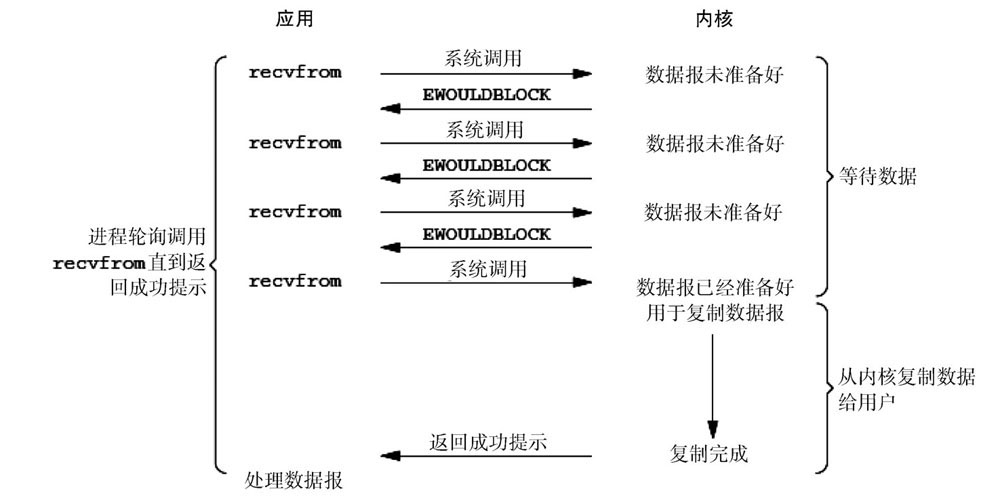
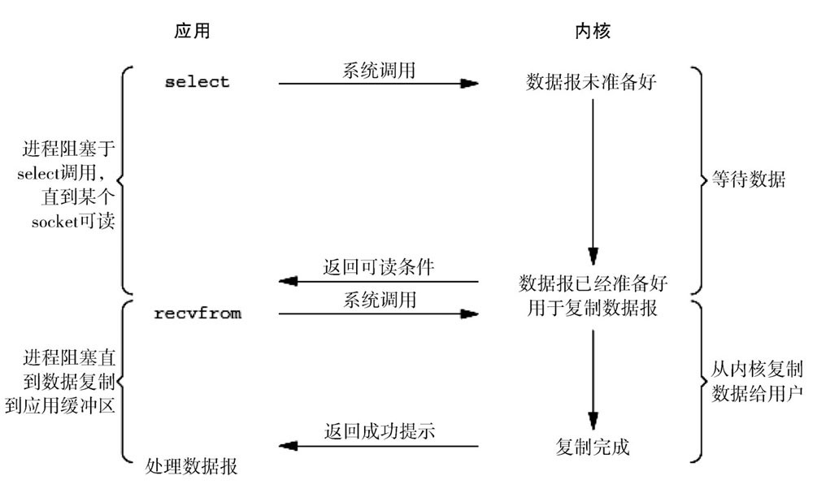
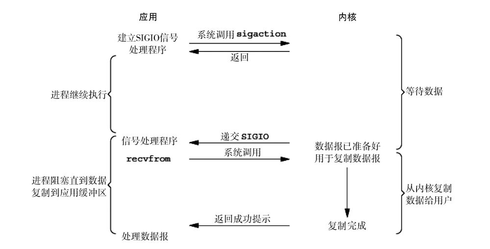
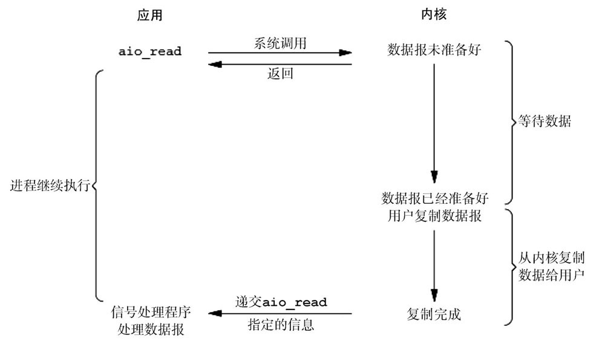
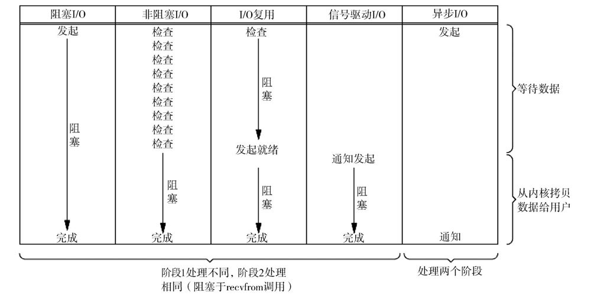

# 网络轮询器

网络轮询器是Go语言运行时用来处理I/O操作的关键组件，它使用了操作系统提供的I/O多路复用机制增强程序的并发处理能；  
网络轮询器不仅用于监控网络I/O，还能用于监控文件的I/O，它利用了操作系统提供的I/O多路复用模型来提升I/O设备的利用率以及程序的性能。

## I/O模型

UNIX下共有5种I/O模型

阻塞式IO（blocking IO）  
非阻塞式IO（non-blocking IO）  
IO复用（IO multiplexing）  
信号驱动式IO（signal driven IO）  
异步IO（asynchronous IO）  

## 阻塞式IO（blocking IO）  

请求无法立即完成则保持阻塞。  
>● 阶段1：等待数据就绪；网络I/O的情况就是等待远端数据陆续抵达；磁盘I/O的情况就是等待磁盘数据从磁盘上读取到内核态内存中。  
>● 阶段2：数据复制；出于系统安全考虑，用户态的程序没有权限直接读取内核态内存，因此内核负责把内核态内存中的数据复制一份到用户态内存中。



当我们执行read系统调用时，应用程序会从用户态陷入内核态，内核会检查文件描述符是否可读；当文件描述符中存在数据时，操作系统内核会将准备好的数据拷贝给应用程序并交回控制权。  

操作系统中多数的 I/O 操作都是如上所示的阻塞请求，一旦执行 I/O 操作，应用程序会陷入阻塞等待 I/O 操作的结束。

## 非阻塞式IO（non-blocking IO）

>● socket设置为NONBLOCK（非阻塞）就是告诉内核，当所请求的I/O操作无法完成时，不要让进程进入睡眠状态，而是立刻返回一个错误码（EWOULDBLOCK），这样请求就不会阻塞；  
>● I/O操作函数将不断地测试数据是否已经准备好，如果没有准备好，则继续测试，直到数据准备好为止。在整个I/O请求的过程中，虽然用户线程每次发起I/O请求后可以立即返回，但是为了等到数据，仍需轮询、重复请求，而这是对CPU时间的极大浪费。  
>● 数据准备好了，从内核复制到用户空间。



一般很少直接使用这种模型，而是在其他I/O模型中使用非阻塞I/O这一特性。这种方式对单个I/O请求的意义不大，但给I/O复用铺平了道路。

## IO复用（IO multiplexing）

I/O复用会用到select或poll函数，在这两个系统调用中的某一个上阻塞，而不是阻塞于真正的I/O系统调用。函数也会使进程阻塞，但和阻塞I/O不同的是，这两个函数可以同时阻塞多个I/O操作；而且可以同时对多个读操作、多个写操作的I/O函数进行检测，直到有数据可读或可写时，才真正调用I/O操作函数。



从流程上看，使用select函数进行I/O请求和同步阻塞模型没有太大的区别，甚至还多了添加监视socket，以及调用select函数的额外操作，效率更差。但是，使用select函数最大的优势是用户可以在一个线程内同时处理多个socket的I/O请求。用户可以注册多个socket，然后不断地调用select来读取被激活的socket，达到在同一个线程内同时处理多个I/O请求的目的。而在同步阻塞模型中，必须通过多线程的方式才能达到这个目的。

I/O复用模型使用Reactor设计模式实现了这一机制。

调用select或poll函数的方法由一个用户态线程负责轮询多个socket，直到阶段1的数据就绪，再通知实际的用户线程执行阶段2的复制操作。通过一个专职的用户态线程执行非阻塞I/O轮询，模拟实现阶段1的异步化。

### select

监听能力有限：最多监听1024个描述符  
内存拷贝开销大：需要维护一个较大的数据结构存储文件描述符，该结构需要拷贝到内核中  
时间复杂度 O(n)：返回准备就绪的事件个数后，需要遍历所有的文件描述符；  

### poll

使用链表存储文件描述符，摆脱了1024的数量上限。

### epoll

描述符的限制：  
epoll没有fd的限制，它所支持的fd上限是最大可以打开文件的数目，这个数字一般远大于2048,举个例子,在1GB内存的机器上大约是10万左右，具体数目可以cat /proc/sys/fs/file-max察看,一般来说这个数目和系统内存关系很大。

文件句柄的拷贝：  
每次注册新的事件到epoll句柄中时，会把所有的fd拷贝进内核，而不是在epoll_wait的时候重复拷贝；epoll保证了每个fd在整个过程中只会拷贝一次。

返回指定就绪事件：  
epoll的解决方案不像select或poll一样每次都把current轮流加入fd对应的设备等待队列中，而只在epoll_ctl时把current挂一遍（这一遍必不可少）并为每个fd指定一个回调函数，当设备就绪，唤醒等待队列上的等待者时，就会调用这个回调函数，而这个回调函数会把就绪的fd加入一个就绪链表）。epoll_wait的工作实际上就是在这个就绪链表中查看有没有就绪的fd（利用schedule_timeout()实现睡一会，判断一会的效果）。

### select 、poll、epoll对比

1、select，poll实现需要自己不断轮询所有fd集合，直到设备就绪，期间可能要睡眠和唤醒多次交替。而epoll其实也需要调用epoll_wait不断轮询就绪链表，期间也可能多次睡眠和唤醒交替，但是它是设备就绪时，调用回调函数，把就绪fd放入就绪链表中，并唤醒在epoll_wait中进入睡眠的进程。虽然都要睡眠和交替，但是select和poll在“醒着”的时候要遍历整个fd集合，而epoll在“醒着”的时候只要判断一下就绪链表是否为空就行了，这节省了大量的CPU时间。这就是回调机制带来的性能提升。

2、select，poll每次调用都要把fd集合从用户态往内核态拷贝一次，并且要把current往设备等待队列中挂一次，而epoll只要一次拷贝，而且把current往等待队列上挂也只挂一次（在epoll_wait的开始，注意这里的等待队列并不是设备等待队列，只是一个epoll内部定义的等待队列）。这也能节省不少的开销。

### kqueue

### evport

## 信号驱动式IO（signal driven IO）  

首先，我们允许socket进行信号驱动I/O，并通过调用sigaction来安装一个信号处理函数，进程继续运行并不阻塞。当数据准备好后，进程会收到一个SIGIO信号，可以在信号处理函数中调用recvfrom来读取数据报，并通知主循环数据已准备好被处理，也可以通知主循环，让它来读取数据报。


## 异步IO（asynchronous IO）



## 五种io模型比较

前4种模型的区别是阶段1不相同，阶段2基本相同，都是将数据从内核复制到调用者的缓存区。而异步I/O的两个阶段都不同于前4个模型。



同步I/O操作引起请求进程阻塞，直到I/O操作完成。异步I/O操作不引起请求进程阻塞。上面前4个模型——阻塞I/O模型、非阻塞I/O模型、I/O复用模型和信号驱动I/O模型都是同步I/O模型，而异步I/O模型才是真正的异步I/O。

## Go实现的多路复用

Go语言在网络轮询器中使用I/O多路复用模型处理I/O操作，为了提高I/O多路复用的性能,不同的操作系统也都实现了自己的I/O多路复用函数，Go语言为了提高在不同操作系统上的I/O操作性能，使用平台特定的函数实现了多个版本的网络轮询模块。

```golang
src/runtime/netpoll_epoll.go
src/runtime/netpoll_kqueue.go
src/runtime/netpoll_solaris.go
src/runtime/netpoll_windows.go
src/runtime/netpoll_aix.go
src/runtime/netpoll_fake.go
```

编译器在编译Go语言程序时，会根据目标平台选择树中特定的分支进行编译;

## 参考

[select、poll、epoll之间的区别总结[整理]](https://www.cnblogs.com/Anker/p/3265058.html)  
