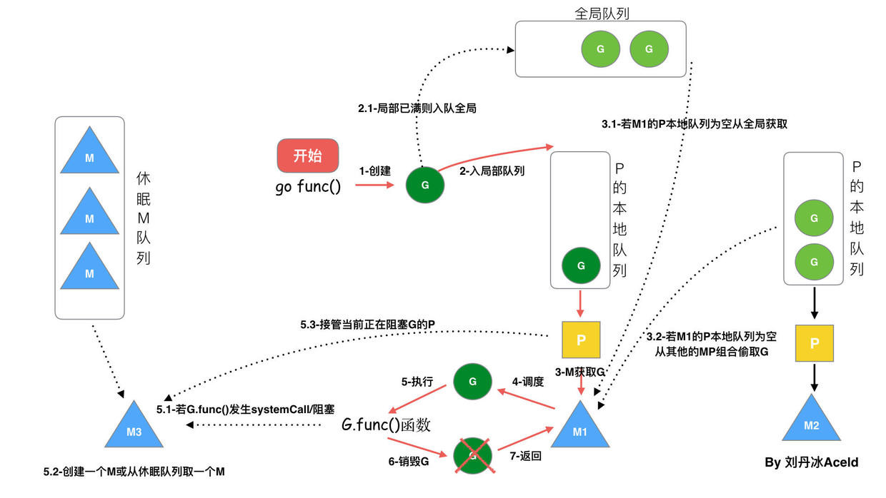

# 调度器

## 调度器的由来

### 单进程时代

**单进程操作系统面临的问题**  
1、单一的执行流程，计算机只能一任务一个任务处理  
2、进程阻塞带来CPU资源的浪费

### 多进程、线程

使用多进程/线程的操作系统中，解决了阻塞问题；在一个进程阻塞CPU可以立刻切换到其他进程中去执行，这样就可以提高CPU资源的利用。

**多进程、线程系统面临的问题**  
同样使用多进程/线程仍有新的问题，进程占用太多的资源，进程的创建、切换、销毁会占用很长时间，CPU虽然利用起来了，但如果进程过多，CPU有很大的一部分都被用来进行进程调度了。

高内存占用  
频繁调度消耗CPU资源

### 协程

多进程、多线程已经提高了系统的并发能力，但是在当今互联网高并发场景下，为每个任务都创建一个线程是不现实的，因为会消耗大量的资源；在我们系统级别调度下线程分为“内核态”和“用户态”线程；一个“用户态”线程必须要绑定一个“内核态”线程；这样我们就称“用户态”线程成为“协程”。

#### 线程与协程关系

N:1  N个系统线程对应一个用户协程  
1:1  一个系统线程对应一个用户协程  
N:M  N个系统线程对应M个用户协程  

## GMP调度模型及设计思想

### Goroutine

Goroutine是golang实际并发执行的实体，底层是使用协程（coroutine）实现并发，coroutine是一种运行在用户态的用户线程；
它具有如下特点：  
>1、使用用户空间，可以避免了内核态和用户态的切换的成本  
>2、可以由语言和框架层进行调度  
>3、占用更小的栈空间，允许创建大量的实体  

### GMP模型的组成

Golang内部有三个对象：P对象（processor）代表上下文或者可以认为是处理器，M对象（workthread）代表工作线程，G对象（goroutine）。

G(Goroutine)：我们所说的协程，为用户及的轻量级线程，每个groutine对象中的sched保存着其上下文信息；  
M(Machine)：对OS内核级线程的封装  
P(Processor)：逻辑处理器，即为G和M的调度对象，用来调度G和M之间的关联关系，其数量为默认核心数

### 调度模型

1、全局队列(Global Queue):存放等待运行的G  
2、P的本地队列：同全局队列类似，存放的也是等待运行的G，存的数量有限，不超过256个。新建G时，G优先加入到P的本地队列，如果队列满了，则会把本地队列中一半的G移动到全局队列。  
3、P列表：所有的P都在程序启动时创建，并保存在数组中，最多有GOMAXPROCS(可配置) 个。
4、M:线程想运行任务就得获取P，从P的本地队列获取G，P队列为空时，M也会尝试从全局队列拿一批G放到P的本地队列，或从其他P的本地队列偷一半放到自己P的本地队列；M运行G，G执行之后，M会从P获取下一个G，不断重复下去。

GMP调度器和OS调度器是通过M结合起来的，每个M都代表了1个内核线程，OS调度器负责把内核线程分配到CPU的核上执行。

#### P和M的个数问题

P的数量：  
由启动时环境变量GOMAXPROCS或者是由runtime.GOMAXPROCS()的方法决定；这意味着在程序执行的任意时刻最多有GOMAXPROCS个goroutine在同时运行；数量一般为CPU核心数。  

M的数量：
>go语言本身的限制：go程序启动时，会设置M的最大数量，默认10000. 但是内核很难支持这么多的线程数，所以这个限制可以忽略;  
>runtime/debug包中的SetMaxThreads()函数，设置M的最大数量;  
>go程序只有在一个go程准备要执行，但现有的线程都阻塞在系统调用、cgo调用或被runtime.LockOSThread函数阻塞在其他go程时，才会创建一个新的线程  

M与P的数量没有绝对关系，一个M阻塞，P就会去创建或者切换另一个M，所以，即使P的默认数量是1，也有可能会创建很多个M出来。

#### P和M何时被创建

1、P何时创建：在确定了P的最大数量n后，运行时系统会根据这个数量创建n个P。  
2、M何时创建：没有足够的M来关联P并运行其中的可运行的G；比如所有的M此时都阻塞住了，而P中还有很多就绪任务，就会去寻找空闲的M，而没有空闲的，就会去创建新的M。

### 调度器的设计策略

#### 复用线程

避免频繁的创建、销毁线程、而是对线程的复用  

work stealing(工作窃取机制)：  
当本线程无可运行的G时，尝试从其他线程绑定的P偷取G，而不是销毁线程。

hand off(放手机制)：  
当本线程因为G进行系统调用阻塞时，线程释放绑定的P，把P转移给其他空闲的线程执行。

#### 利用并行

GOMAXPROCS设置P的数量，最多有GOMAXPROCS个线程分布在多个CPU上同时运行;GOMAXPROCS也限制了并发的程度，比如GOMAXPROCS = 核数/2，则最多利用了一半的CPU核进行并行。

#### 抢占

在coroutine中要等待一个协程主动让出CPU才执行下一个协程；  
在Go中，一个goroutine最多占用CPU 10ms，防止其他goroutine被饿死，这就是goroutine不同于coroutine的一个地方。

#### 全局G队列

在新的调度器中依然有全局G队列，但功能已经被弱化了，当M执行work stealing从其他P偷不到G时，它可以从全局G队列获取G。

### 调度流程

​ 1、我们通过go func ()来创建一个goroutine；

​ 2、有两个存储G的队列，一个是局部调度器P的本地队列、一个是全局G队列，新创建的G会先保存在P的本地队列中，如果P的本地队列已经满了就会保存在全局的队列中；

​ 3、G只能运行在M中，一个M必须持有一个P，运行中的M与P是1：1的关系。M会从P的本地队列弹出一个可执行状态的G来执行，如果P的本地队列为空，就会向其他的MP组合偷取一个可执行的G来执行；

​ 4、一个M调度G执行的过程是一个循环机制；

​ 5、当M执行某一个G时候如果发生了syscal或则其他阻塞操作，M会阻塞，如果当前有一些G在执行，runtime会把这个线程M从P中摘除)，然后再创建一个新的操作系统的线程 (如果有空闲的线程可用就复用空闲线程) 来服务于这个P；

​ 6、当M系统调用结束时候，这个G会尝试获取一个空闲的P执行，并放入到这个P的本地队列，如果获取不到P，那么这个线程M变成休眠状态，加入到空闲线程中，然后这个G会被放入全局队列中。

### 调度器的生命中周期

特殊的M0和G0

M0:  
M0是启动程序后的编号为0的主线程，这个M对应的实例会在全局变量runtime.m0中，不需要在heap上分配，M0负责执行初始化操作和启动第一个G， 在之后M0就和其他的M一样了。

G0:  
G0是每次启动一个M都会第一个创建的gourtine，G0仅用于负责调度的G，G0不指向任何可执行的函数，每个M都会有一个自己的G0。在调度或系统调用时会使用G0的栈空间，全局变量的G0是M0的G0。

调度器的生命周期几乎占满了一个Go程序的一生，runtime.main的goroutine执行之前都是为调度器做准备工作，runtime.main的goroutine运行，才是调度器的真正开始，直到runtime.main结束而结束。

## 调度场景

## 参考

[Golang 调度器 GMP 原理与调度全分析](https://learnku.com/articles/41728)

原文作者：Aceld  
转自链接：<https://learnku.com/articles/41728>  
版权声明：著作权归作者所有。商业转载请联系作者获得授权，非商业转载请保留以上作者信息和原文链接。  
