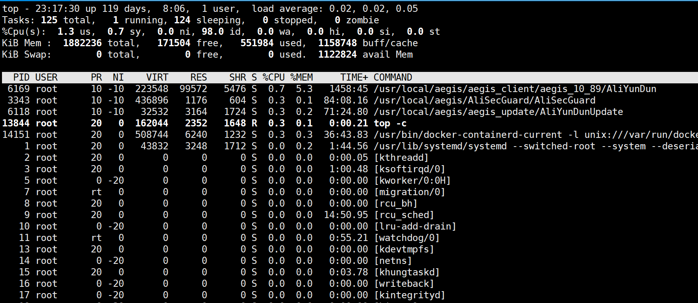

# 操作系统相关常见问题

## 什么是进程？

进程是具有一定独立功能的程序关于某个数据集合上的一次运行活动,进程是系统进行资源分配和调度的一个独立单位。 每个进程都有自己的独立内存空间，不同进程通过进程间通信来通信。由于进程比较重量，占据独立的内存，所以上下文进程间的切换开销（栈、寄存器、虚拟内存、文件句柄等）比较大，但相对比较稳定安全。

## 什么是线程？

线程是进程的一个实体,线程是内核态,而且是CPU调度和分派的基本单位,它是比进程更小的能独立运行的基本单位.线程自己基本上不拥有系统资源,只拥有一点在运行中必不可少的资源(如程序计数器,一组寄存器和栈),但是它可与同属一个进程的其他的线程共享进程所拥有的全部资源。 线程间通信主要通过共享内存，上下文切换很快，资源开销较少，但相比进程不够稳定容易丢失数据。

## 进程与线程的区别？

资源（如打开文件）：进程间的资源相互独立，同一进程的各线程间共享资源；某进程的线程在其他进程不可见。  
通信：进程间通信：消息传递、同步、共享内存、远程过程调用、管道。线程间通信：直接读写进程数据段（需要进程同步和互斥手段的辅助，以保证数据的一致性）。  
调度和切换：线程上下文切换比进程上下文切换要快得多。  
线程，是操作系统最小的执行单元，在单线程程序中，任务一个一个地做，必须做完一个任务后，才会去做另一个任务。  

## 协程

协程是一种用户态的轻量级线程，协程的调度完全由用户控制。协程拥有自己的寄存器上下文和栈。 协程调度切换时，将寄存器上下文和栈保存到其他地方，在切回来的时候，恢复先前保存的寄存器上下文和栈，直接操作栈则基本没有内核切换的开销，可以不加锁的访问全局变量，所以上下文的切换非常快。

## 怎么查看一个程序是否正常运行，该程序端口为801

1、通过netstat -ntlp | grep 8010 查询到程序的进程ID  
2、然后通过 top -p pid 查看当前进程运行情况

## 如何查找一个文件？

find /etc -name nginx.conf  
locate nginx.conf  

## 怎么查找一个字符串，在哪些文件里?

grep -Ri "name"

## top命令信息解读?

第一行表示的项目依次为当前时间、系统运行时间、当前系统登录用户数目、1/5/10分钟系统平均负载(一般来说，这个负载值应该不太可能超过 1 才对，除非您的系统很忙碌。 如果持续高于 5 的话，那么.....仔细的看看到底是那个程序在影响整体系统吧！)。

第二行显示的是所有启动的进程、目前运行、挂起 (Sleeping)的和无用(Zombie)的进程。(比较需要注意的是最后的 zombie 那个数值，如果不是 0 ，嘿嘿！好好看看到底是那个 process 变成疆尸了吧？！)(stop模式：与sleep进程应区别，sleep会主动放弃cpu，而stop是被动放弃cpu ，例单步跟踪，stop（暂停）的进程是无法自己回到运行状态的)

第三行显示的是目前CPU的使用情况，包括us用户空间占用CPU百分比、sy 内核空间占用CPU百分比、ni 用户进程空间内改变过优先级的进程占用CPU百分比(中断处理占用)、id 空闲CPU百分比、wa 等待输入输出的CPU时间百分比、hi,si,st 三者的意思目录还不清楚 ：)

第四行显示物理内存的使用情况，包括总的可以使用的内存、已用内存、空闲内存、缓冲区占用的内存。

第五行显示交换分区使用情况，包括总的交换分区、使用的、空闲的和用于高速缓存的大小。

第六行开始展示当前系统进运行的状态。
