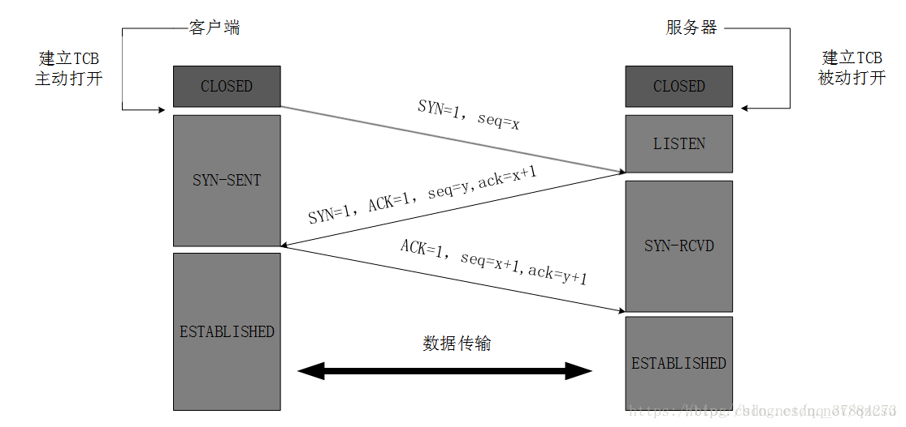
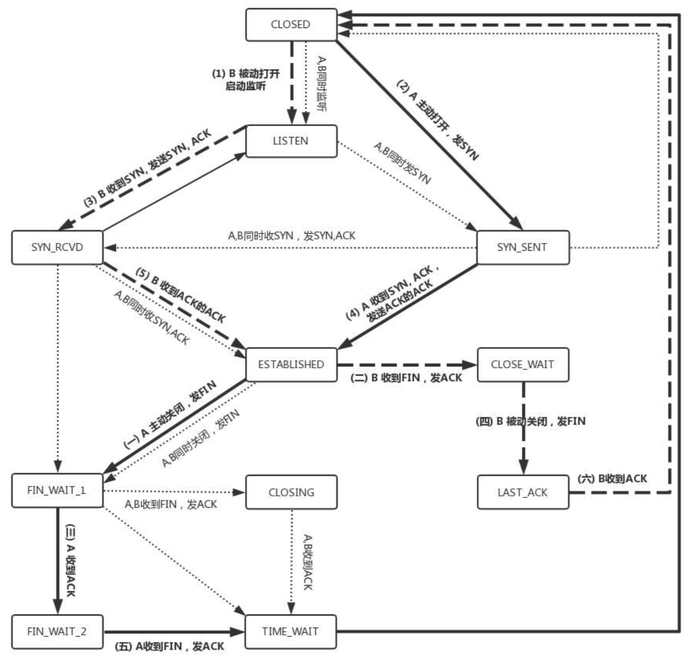

# 网络

## 多路复用模型select poll  epoll

## 输入URL到浏览器发生了什么？

1、浏览器会调用网络组件，通过DNS获取当前域名的IP地址  
2、拿到IP地址，与服务段建立TCP链接  
3、建立链接之后向服务端发送请求数据  
4、服务端处理数据之后返回给浏览器
5、浏览器针对相应数据进行渲染

## DNS基于TCP还是UDP，为什么？

1、基于UDP，请求和响应内容段  
2、不需要经过TCP三次握手，降低DNS服务器压力  

## 域名解析的流程

1) 客户端通过浏览器访问域名为 www.baidu.com (<http://www.baidu.com>) 的网站，发起查询该域名的 IP 地址的 DNS 请求。该请求发送到了本地 DNS 服务器上。本地 DNS 服务器会首先查询它的缓存记录，如果缓存中有此条记录，就可以直接返回结果。如果没有，本地 DNS 服务器还要向 DNS 根服务器进行查询。  

2) 本地 DNS 服务器向根服务器发送 DNS 请求，请求域名为 www.baidu.com (<http://www.baidu.com>) 的 IP 地址。

3) 根服务器经过查询，没有记录该域名及 IP 地址的对应关系。但是会告诉本地 DNS 服务器，可以到域名服务器上继续查询，并给出域名服务器的地址（.com 服务器）。

4) 本地 DNS 服务器向 .com 服务器发送 DNS 请求，请求域名 www.baidu.com (<http://www.baidu.com>) 的 IP 地址。

5) .com 服务器收到请求后，不会直接返回域名和 IP 地址的对应关系，而是告诉本地 DNS 服务器，该域名可以在 baidu.com 域名服务器上进行解析获取 IP 地址，并告诉 baidu.com 域名服务器的地址。

6) 本地 DNS 服务器向 baidu.com 域名服务器发送 DNS 请求，请求域名 www.baidu.com (<http://www.baidu.com>) 的 IP 地址。

7) baidu.com 服务器收到请求后，在自己的缓存表中发现了该域名和 IP 地址的对应关系，并将IP地址返回给本地 DNS 服务器。

8) 本地 DNS 服务器将获取到与域名对应的 IP 地址返回给客户端，并且将域名和 IP 地址的对应关系保存在缓存中，以备下次别的用户查询时使用。

## 描述HTTP状态码

HTTP状态码用于表示HTTP请求响应结果的状态码，状态码由三位十进制数字组成，第一位表示状态码的类型，共有五种类型；

|分类|描述|
|-----|-----|
|1**|信息，服务器收到请求，需要请求中继续执行操作|
|2**|成功，操作被成功接收并处理|
|3**|重定向，需要进一步操作完成请求|
|4**|客户端错误，请求包含语法错误或无法完成请求|
|5**|服务器错误，服务器在处理请求的过程中发生了错误|

## 描述session和cookie，cookie是怎么传输的

### 相同之处

cookie和session都是用来跟踪浏览器用户身份的会话方式。

### 区别之处

1、cookie数据存放在客户的浏览器上，session数据放在服务器上；  
2、cookie不是很安全，别人可以分析存放在本地的COOKIE并进行COOKIE欺骗,如果主要考虑到安全应当使用session；  
3、session会在一定时间内保存在服务器上。当访问增多，会比较占用你服务器的性能，如果主要考虑到减轻服务器性能方面，应当使用cookie；  
4、cookie有代销限制

### cookie传输流程

1、由客户端首次请求时服务端生成  
2、服务端生成后，随着响应返回给客户端  
3、之后的每次客户端与服务端交互中携带cookie  

## 如何告诉客户端，响应的是什么数据类型？

通过http的响应头Content-Type告知客户端响应的数类型

## 网络分层

应用层-》传输层-》网络层-》链路层-》物理层

应用层：HTTP、FTP、SMTP、DNS  
传输层：TCP、UDP  
网络层：IP  
链路层：DOCSIS  
物理层：网卡

## TCP三次握手

TCP是一个面向连接的协议，无论哪一方向另一方发送数据之前，都必须现在双方之间建立一条连接；

三次握手的过程：  
第一次握手：建立连接时，客户端发送syn包（syn=x）到服务器，并进入SYN_SENT状态，等待服务器确认；  
第二次握手：服务器收到syn包，必须确认客户的SYN（ack=x+1）,同时自己也发送一个SYN包（sync=y）,即SYN+ACK，此时服务器进入SYN_RECV状态;  
第三次握手：客户端收到服务器的SYN+ACK包，向服务器发送确认包ACK，此包发送完毕，客户端和服务端进入ESTABLISHED状态，完成三次握手。

## TCP四次挥手

TCP终止连接过程

1、客户端进程发出连接释放报文FIN，并且停止发送数据，此时客户端进入FIN-WAIT-1（终止状态1）状态；  
2、服务器收到连接释放报文，发出确认报文ACK，此时服务端就进入了CLOSE-WAIT（关闭等待）状态；TCP服务器通知高层的应用进程，客户端向服务器的方向就释放了，这时候处于半关闭状态，即客户端已经没有数据要发送了，但是服务器若发送数据，客户端依然要接受；这个状态还要持续一段时间，也就是整个CLOSE-WAIT状态持续的时间。  
3、客户端收到服务器的确认请求后，此时，客户端就进入FIN-WAIT-2（终止等待2）状态，等待服务器发送连接释放报文（在这之前还需要接受服务器发送的最后的数据）。  
4、服务器将最后的数据发送完毕后，就像客户端发送连接释放报文FIN，由于在半关闭状态，服务器很可能又发送了一些数据，服务器就进入了LAST-ACK（最后确认）状态，等待客户端的确认。  
5、客户端收到服务器的连接释放报文后，必须发出确认ACK，此时客户端就进入了TIME-WAIT（时间等待）状态；注意此时TCP连接还没有释放，必须经过2*MSL（最长报文段寿命）的时间后，当客户端撤销响应的TCB后，才进入CLOSED状态。  
6、服务器只要收到了客户端发出的确认，立即进入CLOSED状态。同样，撤销TCB后，就结束了这次的TCP连接。可以看到，服务器结束TCP连接的时间要比客户端早一些。

## TCP状态机

1、CLOSED:状态初始状态。  
2、LISTEN:服务端的监听指定socket的状态。  
3、SYN_RCVD:服务端收到SYN后，状态为SYN，发送SYN ACK。  
4、SYN_SENT:应用程序发送SYN后，状态进入SYN_SENT。  
5、ESTABLISHED:SYN_RCVD收到ACK后，状态为ESTABLISHED；SYN_SENT收到SYN ACK，在发送ACK之后，状态变为ESTABLISHED。  
6、CLOSE_WAIT：服务端u你收到FIN受，发送ACK，状态为CLOSE_WAIT;如果此时服务器端还有数据需要发送，那么就发送，直到数据发送完毕；此时，服务器端发送FIN，状态变为 LAST_ACK。  
7、FIN_WAIT_1：应用程序端发送FIN，准备断开TCP连接；状态从ESTABLISHED -> FIN_WAIT_1。  
8、FIN_WAIT_2：应用程序端只收到服务器端得ACK信号，并没有收到FIN信号；说明服务器端还有数据传输，那么此时为半连接。  
9、TIME_WAIT：
    FIN_WAIT_1进入：此时应用程序端口收到 FIN+ACK（而不是像 FIN_WAIT_2 那样只收到 ACK，说明数据已经发送完毕）并向服务器端口发送 ACK；

    FIN_WAIT_2进入：此时应用程序端口收到了 FIN，然后向服务器端发送 ACK；TIME_WAIT 是为了实现 TCP 全双工连接的可靠性关闭，用来重发可能丢失的 ACK 报文；需要持续 2 个 MSL (最大报文生存时间)：假设应用程序端口在进入 TIME_WAIT后，2 个 MSL 时间内并没有收到FIN,说明应用程序最后发出的 ACK 已经收到了；否则，会在 2 个 MSL 内在此收到ACK报文；

## TCB

[TCP 三次握手和四次挥手图解（有限状态机）](https://www.cnblogs.com/huansky/p/13951567.html)

### TCP三次握手，四次挥手说一下，为什么需要三次握手，最后一次如果没有行不行，会有什么问题？

### TIME_WAIT的作用是什么？2MSL是多长？

### 线上大量的close_wait和time_wait该如何解决？

http2.0的优点说一下。了解QUIC吗？怎么实现的？

https的握手过程说一下。证书是如何验证的？为什么不用非对称加密通信？

浏览器输入一个url到返回，整个过程说一下，都用到了哪些协议？浏览器的渲染过程了解吗？

一台服务器最多可以建立多少个TCP链接，为什么？
