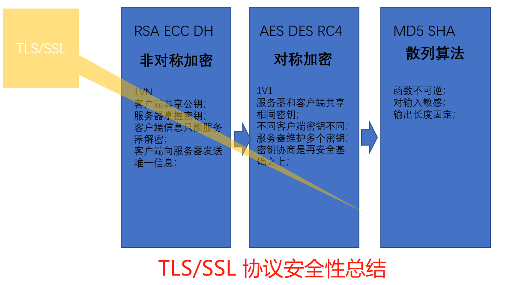

# HTTP

## HTTP定义

超文本传输

HTTP/0.9是HTTP的第一个版本，于1991年引入。  
HTTP/1.0在RFC 1945中指定，并于1996年引入。  
HTTP/1.1在RFC 2616中指定，并于1997年1月正式发布。  
HTTP/2在RFC 7540中指定，并于2015年5月14日正式发布，它通过压缩HTTP标头以及对数据请求进行优先级处理和多路复用，从而缩短了浏览器中的页面加载时间。

### HTTP1.0与HTTP1.1的区别

1、缓存处理：http1.0增加了更多类型缓存策略  
2、数据传输优化：http1.1支持断点续传，范围请求  
3、错误状态：http1.1增加了等多响应状态  
4、长连接：HTTP1.1支持长连接（PersistentConnection）和请求的流水线（Pipelining）处理，在一个TCP连接上可以传送多个HTTP请求和响应，减少了建立和关闭连接的消耗和延迟，在HTTP1.1中默认开启Connection： keep-alive，一定程度上弥补了HTTP1.0每次请求都要创建连接的缺点。

### 描述HTTP状态码

HTTP状态码用于表示HTTP请求响应结果的状态码，状态码由三位十进制数字组成，第一位表示状态码的类型，共有五种类型；

|分类|描述|
|-----|-----|
|1**|信息，服务器收到请求，需要请求中继续执行操作|
|2**|成功，操作被成功接收并处理|
|3**|重定向，需要进一步操作完成请求|
|4**|客户端错误，请求包含语法错误或无法完成请求|
|5**|服务器错误，服务器在处理请求的过程中发生了错误|

## HTTP2.0

帧：HTTP/2 数据通信的最小单位消息；  
流：存在于连接中的一个虚拟通道；流可以承载双向消息，每个流都有一个唯一的整数ID；  

HTTP/2采用二进制格式传输数据，而非HTTP1.x的文本格式，二进制解析起来更高效；  
HTTP/1的请求和响应报文，都是由起始行，首部和实体正文（可选）组成，各部分之间以文本换行符分隔。  
HTTP/2将请求和响应数据分割为更小的帧，并且它们采用二进制编码。

### HTTP1.1的问题

1、队头阻塞  
在HTTP请求应答过程中，如果出现了某种情况，导致响应一直未能完成，那后面所有的请求就会一直阻塞；  
2、低效的TCP利用  
由于**TCP慢启动机制**，导致每个TCP连接在以开始的时候传输速率都不高，在处理多个请求后，才会慢慢达到合适的速率；  
3、臃肿的消息首部  
HTTP/1.1的首部无法压缩，再加上cookie的存在，和自定义的头部信息，可能会出现首部大小比请求数据大小还大的情况；  
4、受限的优先级设置  
HTTP/1.1无法为重要的资源指定优先级，每个HTTP请求都是一视同仁；  

### HTTP2.0主要用来解决什么问题？

1、复用连接：允许同一条连接上交错请求和响应信息；  
2、节省header的传输：针对HTTP标准头信息进行有效编码；  
3、设置请求优先级：允许对请求进行优先级排序，从而使更重要请求可以快速完成，进一步提高性能；  
4、支持消息推送，带来性能提升；  

### HTTP2.0一个TCP如何区别不同的请求?
流ID用来表示帧所属的流，  
客户端到服务器的HTTP/2连接建立后，通过发送HEADERS帧来启动新的流。

## HTTPS

HTTPS代表安全超文本传输​​协议，是一种用于通过连接传输HTTP的协议，该传输由传输层安全性加密，HTTPS用于防止传输的数据被窃听。  
HTTPS使用端口443传输信息。  
HTTPS首先在HTTP/1.1中使用，并在[RFC 2616](https://www.rfc-editor.org/rfc/rfc2616.html)中定义。  

### 为什么发明HTTPS

为解决数据在网络传输上的安全问题，例如中间人攻击问题  

### HTTP与HTTPS的区别

1、HTTPS协议需要到ca申请证书，用来传输服务器的公钥及验证服务器是否为有效来源；  
2、HTTP是超文本传输协议，信息是明文传输，HTTPS则是通过TLS/SSL协议保证数据传输安全性的；  
3、HTTPS在TCP建立连接之前，通过TLS/SSL建立安全通道;端口也不一样，前者是80，后者是443。  
4、HTTP的连接很简单，是无状态的；HTTPS协议是由SSL+HTTP协议构建的可进行加密传输、身份认证的网络协议，比HTTP协议安全。

### TSL/SSL协议的目标

1、数据是机密的：通信两端传输的数据应该是安全的，不可伪造和篡改的；  
2、互操作性：TLS/SSL协议是标准的，任何开发者基于TLS/SSL RFC设计规范都可以实现协议；  
3、扩展性：针对密码算法可以动态引入；  
4、效率：解决方案必须是高效的；  

### TSL/SSL协议核心三大步骤

认证、密钥协商、数据加密

### TLS/SSL协议安全性总结

### HTTPS交互过程

1、通过数字证书验证服务器的有效性  
2、客户端与服务端协商对称加密的信息  
3、通过密文的方式，传递数据

非对称加解密密钥是用于TLS握手阶段的  
对称密钥是用于后续传输数据加解密的  

### 数字证书

HTTPS中引入数字证书概念来解决传递服务器公钥过程中的可能出现的中间人劫持问题。

数字证书中包含公钥，证书主体，数字签名等内容

#### 数字证书的作用

1、身份授权：确保浏览器访问的网站是经过CA验证的可信任的网站。  
2、传递公钥：每个数字证书都包含了注册者生成的公钥（验证确保是合法的，非伪造的公钥），在SSL握手时会通过certificate消息传输给客户端。  
3、验证证书合法性：客户端接收到数字证书后，会对证书合法性进行验证。只有验证通过后的证书，才能够进行后续通信过程。

#### 数字证书的流程

服务器首先生成公私钥，将公钥提供给相关机构（CA），CA将公钥放入数字证书并将数字证书颁布给服务器，  
此时服务器就不是简单的把公钥给客户端，而是给客户端一个数字证书，  
数字证书中加入了一些数字签名的机制，保证了数字证书一定是服务器给客户端的。

### 密码学的四个基本目标

1、机密性  
在网络中传递的数据如果具备机密性，那么传输的数据就是一串无意义的数字，只有拥有密钥的才能解释这些数据，密钥是加密算法的关键。  
在密码学中，对称加密算法和公开密钥算法都能够保证机密性。

2、完成性  
完整性表示接收方能够确保接收到的数据就是发送方发送的原始数据，假设数据被中间人篡改，接收方如果有策略知晓数据被篡改了，那么传递的数据就具备完整性。  
在密码学中，主要使用消息验证码（MAC）算法保证完整性。需要注意的是互联网传输的数据即使是加密的也无法保证完整性，本章后续部分会进行详细的描述。

3、身份验证  
互联网应用一般都有发送方和接收方，对于接收方来说，必须确认发送方的身份，才能确保收到的数据就是真实发送方发送的；反之对于发送方来说也是一样的，通信双方必须确保对端就是要通信的对象。  
在密码学中，一般使用数字签名技术确认身份

4、不可抵赖性

这个目标在第1章没有涉及，举个例子，A向B借钱了，并写了张借条，当B希望A还钱的时候，A抵赖说这张借条不是他写的，理由就是有人冒充他写了这张借条，A的行为可以抵赖。  
在密码学中，数字签名技术能够避免抵赖。

### 获取证书和秘钥对

自签名证书，如果开发者只想测试HTTPS，最快速的途径就是生成签名证书，非常方便；  
Let's Encrypt证书，可以使用免费CA机构签发的证书；  
使用收费CA机构签发的证书，如果对证书安全性、兼容性、功能有特殊需求，可以向CA机构申请证书；

#### 获取自签名证书

1、生成私钥对和CSR（证书签名请求，包含服务器的密钥对）  
example_key.pem表示密钥对文件，example_cert.pem表示CSR文件，example_cert.pem表示证书文件

2、生成自签名证书

### 切换到https可能存在的问题

1、页面内的混合内容(301/HSTS/CSP)  
2、用户主动输出的http地址(301/HSTS)  
3、用户保存的书签http地址(301/HSTS)  

## 参考

[HTTP1.0、HTTP1.1和HTTP2.0的区别](https://www.jianshu.com/p/be29d679cbff)  
[HTTP](https://www.computerhope.com/jargon/h/http.htm)  
[超文本传输​​协议版本2（HTTP / 2）](https://tools.ietf.org/html/rfc7540)  
[RFC2616](https://tools.ietf.org/html/rfc2616)  
[聊聊HTTPS和SSL/TLS协议](http://www.httpclient.cn/archives/60.html)  
[深入揭秘HTTPS安全问题&连接建立全过程](https://zhuanlan.zhihu.com/p/22142170)
