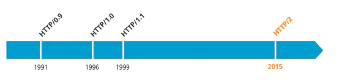

# HTTP

## HTTP定义

超文本传输

HTTP/0.9是HTTP的第一个版本，于1991年引入。  
HTTP/1.0在RFC 1945中指定，并于1996年引入。  
HTTP/1.1在RFC 2616中指定，并于1997年1月正式发布。  
HTTP/2在RFC 7540中指定，并于2015年5月14日正式发布，它通过压缩HTTP标头以及对数据请求进行优先级处理和多路复用，从而缩短了浏览器中的页面加载时间。

### HTTP1.0与HTTP1.1的区别

1、缓存处理：http1.0增加了更多类型缓存策略  
2、数据传输优化：http1.1支持断点续传，范围请求  
3、错误状态：http1.1增加了等多响应状态  
4、长连接：HTTP1.1支持长连接（PersistentConnection）和请求的流水线（Pipelining）处理，在一个TCP连接上可以传送多个HTTP请求和响应，减少了建立和关闭连接的消耗和延迟，在HTTP1.1中默认开启Connection： keep-alive，一定程度上弥补了HTTP1.0每次请求都要创建连接的缺点。

### 描述HTTP状态码

HTTP状态码用于表示HTTP请求响应结果的状态码，状态码由三位十进制数字组成，第一位表示状态码的类型，共有五种类型；

|分类|描述|
|-----|-----|
|1**|信息，服务器收到请求，需要请求中继续执行操作|
|2**|成功，操作被成功接收并处理|
|3**|重定向，需要进一步操作完成请求|
|4**|客户端错误，请求包含语法错误或无法完成请求|
|5**|服务器错误，服务器在处理请求的过程中发生了错误|

## HTTP2.0

### HTTP2.0主要用来解决什么问题？

1、复用连接：允许同一条连接上交错请求和响应信息；  
2、节省header的传输：针对HTTP标准头信息进行有效编码；  
3、设置请求优先级：允许对请求进行优先级排序，从而使更重要请求可以快速完成，进一步提高性能。

## HTTPS

HTTPS代表安全超文本传输​​协议，是一种用于通过连接传输HTTP的协议，该传输由传输层安全性加密，HTTPS用于防止传输的数据被窃听。  
HTTPS使用端口443传输其信息。  
HTTPS首先在HTTP/1.1中使用，并在RFC 2616中定义。  

### TSL/SSL协议的目标

1、数据是机密的：通信两端传输的数据应该是安全的，不可伪造和篡改的；  
2、互操作性：TLS/SSL协议是标准的，任何开发则基于TLS/SSL RFC设计规范都可以实现协议；  
3、扩展性：针对密码算法可以动态引入；  
4、效率：解决方案必须是高校的；  

## 参考

[HTTP1.0、HTTP1.1和HTTP2.0的区别](https://www.jianshu.com/p/be29d679cbff)  
[HTTP](https://www.computerhope.com/jargon/h/http.htm)  
[超文本传输​​协议版本2（HTTP / 2）](https://tools.ietf.org/html/rfc7540)
