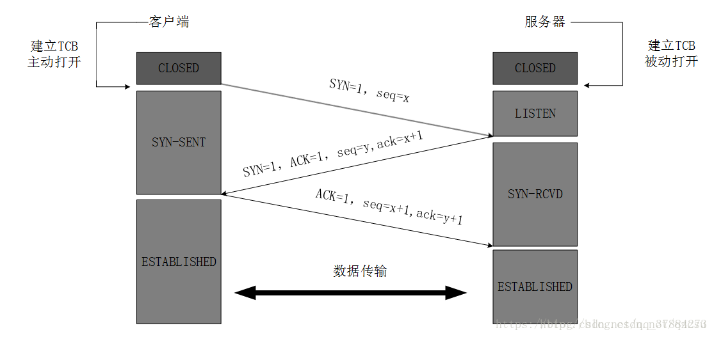
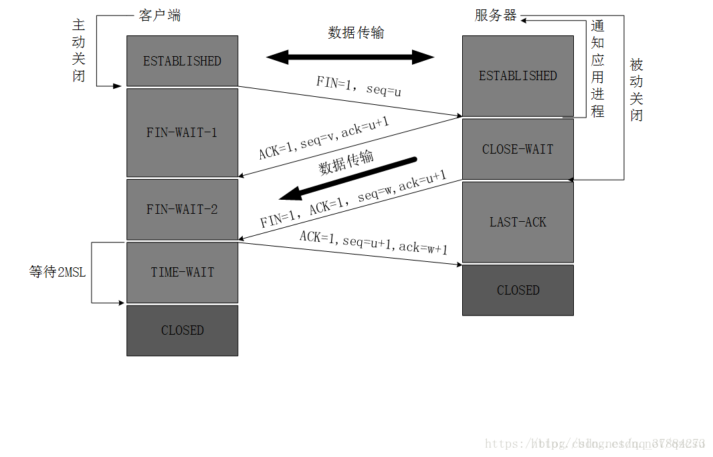

# TCP

传输控制协议（TCP，Transmission Control Protocol）是一种面向连接的、可靠的、基于字节流的传输层通信协议，由IETF的RFC793定义，是为了在不可靠的互联网络上提供可靠的端到端字节流而专门设计的一个传输协议。

## TCP特点

1、是面向连接的传输层协议，应用程序在使用TCP协议之前，必须先建立TCP连接，在传送数据完毕后，必须释放已经建立的TCP连接；  
2、每一条TCP连接只能有两个端点，每一条TCP连接只能是点对点的(一对一)；  
3、TCP提供可靠交付的服务，通过TCP连接传送的数据，无差错、不丢失、不重复，并且按序到达；  
4、TCP提供全双工通信，允许通信双方的应用进程在任何时候都能发送数据，连接的两端都设有发送缓存和接受缓存，用来临时存放双向通信的数据；  
5、面向字节流，TCP中的“流”指的是流入到进程或从进程流出的字节序列。  

## 如何保证可靠传输？

1、使用确认机制，针对接到的请求要对发送放回复确认机制  
2、超时重传机制，针对出现超时的情况要进行重置

### 停止等待协议

优点：简单  
缺点：信道利用率低  


### 连续ARQ(AutomaticRepeat reQuest)协议


## TCP发送时机？

1、TCP中维持一个变量，它等于最大报文段长度MSS，只要缓存中存放的数据达到MSS字节时，就组装成一个TCP报文段发送出去；  
2、由发送方的应用进程指明要求发送报文段，即TCP支持的推送(push)操作；  
3、发送方的一个计时器期限到了，这时把当前已有的缓存数据装入报文段(但长度不能超过MSS)发送出去；  

## TCP消息头


首部固定部分各个字段的意义：  
1、源端口和目的端口：各占2个字节，分别写入源端口号和目的端口号；  
2、序号：占四字节，序号范围【0，2^32-1】;为一个TCP连接中传送的字节流中的每一个字节进行顺序编号；。整个要传送的字节流的起始序号必须在连接建立时设置。  
3、确认号：占4字节，是期望收到对方下一个报文段的第一个数据字节的序号。  
4、数据偏移： 占4位，指出TCP报文段的数据起始处距离TCP报文段的起始处有多远；实际上是指出TCP报文段的首部长度;标识该TCP头部有多少个32bit字节，在没有选项时一般TCP头部都是20字节，值为5。
5、保留：占6位，保留为今后使用，但目前应置为0。  

## TCP为什么需要建立连接？

1、要使每一方能够确知对方的存在；  
2、要允许双方协商一些参数(最大窗口值、是否使用窗口扩大选项和时间戳选项以及服务质量等)  
3、能够对运输实体资源(缓存大小、连接表中的项目等)进行分配

## TCP三次握手

TCP是一个面向连接的协议，无论哪一方向另一方发送数据之前，都必须现在双方之间建立一条连接；



三次握手的过程：  
第一次握手：建立连接时，客户端发送syn包（syn=x）到服务器，并进入SYN_SENT状态，等待服务器确认；  
第二次握手：服务器收到syn包，必须确认客户的SYN（ack=x+1）,同时自己也发送一个SYN包（sync=y）,即SYN+ACK，此时服务器进入SYN_RECV状态;  
第三次握手：客户端收到服务器的SYN+ACK包，向服务器发送确认包ACK，此包发送完毕，客户端和服务端进入ESTABLISHED状态，完成三次握手。

## TCP四次挥手

TCP终止连接过程



1、客户端进程发出连接释放报文FIN，并且停止发送数据，此时客户端进入FIN-WAIT-1（终止状态1）状态；  
2、服务器收到连接释放报文，发出确认报文ACK，此时服务端就进入了CLOSE-WAIT（关闭等待）状态；TCP服务器通知高层的应用进程，客户端向服务器的方向就释放了，这时候处于半关闭状态，即客户端已经没有数据要发送了，但是服务器若发送数据，客户端依然要接受；这个状态还要持续一段时间，也就是整个CLOSE-WAIT状态持续的时间。  
3、客户端收到服务器的确认请求后，此时，客户端就进入FIN-WAIT-2（终止等待2）状态，等待服务器发送连接释放报文（在这之前还需要接受服务器发送的最后的数据）。  
4、服务器将最后的数据发送完毕后，就像客户端发送连接释放报文FIN，由于在半关闭状态，服务器很可能又发送了一些数据，服务器就进入了LAST-ACK（最后确认）状态，等待客户端的确认。  
5、客户端收到服务器的连接释放报文后，必须发出确认ACK，此时客户端就进入了TIME-WAIT（时间等待）状态；注意此时TCP连接还没有释放，必须经过2*MSL（最长报文段寿命）的时间后，当客户端撤销响应的TCB后，才进入CLOSED状态。  
6、服务器只要收到了客户端发出的确认，立即进入CLOSED状态。同样，撤销TCB后，就结束了这次的TCP连接。可以看到，服务器结束TCP连接的时间要比客户端早一些。

## TCP状态机


1、CLOSED:状态初始状态。  
2、LISTEN:服务端的监听指定socket的状态。  
3、SYN_RCVD:服务端收到SYN后，状态为SYN，发送SYN ACK。  
4、SYN_SENT:应用程序发送SYN后，状态进入SYN_SENT。  
5、ESTABLISHED:SYN_RCVD收到ACK后，状态为ESTABLISHED；SYN_SENT收到SYN ACK，在发送ACK之后，状态变为ESTABLISHED。  
6、CLOSE_WAIT：服务端u你收到FIN受，发送ACK，状态为CLOSE_WAIT;如果此时服务器端还有数据需要发送，那么就发送，直到数据发送完毕；此时，服务器端发送FIN，状态变为 LAST_ACK。  
7、FIN_WAIT_1：应用程序端发送FIN，准备断开TCP连接；状态从ESTABLISHED -> FIN_WAIT_1。  
8、FIN_WAIT_2：应用程序端只收到服务器端得ACK信号，并没有收到FIN信号；说明服务器端还有数据传输，那么此时为半连接。  
9、TIME_WAIT：
    FIN_WAIT_1进入：此时应用程序端口收到FIN+ACK（而不是像FIN_WAIT_2那样只收到ACK，说明数据已经发送完毕）并向服务器端口发送ACK；

    FIN_WAIT_2进入：此时应用程序端口收到了FIN，然后向服务器端发送ACK；TIME_WAIT是为了实现TCP全双工连接的可靠性关闭，用来重发可能丢失的ACK报文；需要持续2个MSL(最大报文生存时间)：假设应用程序端口在进入TIME_WAIT后，2个MSL时间内并没有收到FIN,说明应用程序最后发出的ACK已经收到了；否则会在2个MSL内在此收到ACK报文；

## TCB

## 2*MSL

MSL:最长报文段寿命，指一个片段在网络中最大的存活时间，2ML就是一个发送和一个恢复所需的最大时间。

### TCP三次握手，四次挥手说一下，为什么需要三次握手，最后一次如果没有行不行，会有什么问题？

为了实现“可靠数据传输”，TCP协议的通信双方，必须维护一个序列号，以标识发送出去的数据包中， 哪些是已经被对方收到的；三次握手的过程即是通信双方相互告知序列号起始值，并确认对方已经收到了序列号起始值的必经步骤。  
如果只是两次握手，至多只有连接发起方的起始序列号能被确认，另一方选择的序列号则得不到确认。

防止已失效的连接请求又传送到服务器端，因而产生错误。

### TIME_WAIT的作用是什么？2MSL是多长？

用来保证四次挥手的，最后一次确认能够有效到达接收方，准确关闭连接

1、保证TCP协议的全双工连接能够可靠关闭  
2、保证这次连接的重复数据段从网络中消失  

### 线上大量的close_wait和time_wait该何解决？

```network
[root@~]$netstat -n | awk '/^tcp/ {++S[$NF]} END {for(a in S) print a, S[a]}'
ESTABLISHED 2
```

解决思路很简单，就是让服务器能够快速回收和重用那些TIME_WAIT的资源。

## http2.0的优点说一下。了解QUIC吗？怎么实现的？

## https的握手过程说一下。证书是如何验证的？为什么不用非对称加密通信？

## 一台服务器最多可以建立多少个TCP链接，为什么？

## HTTPS 建立过程

## 参考

[停止等待协议](https://www.cnblogs.com/fennleo/p/13434741.html)  
[TCP协议详解](https://zhuanlan.zhihu.com/p/64155705)  
[服务器大量TIME_WAIT和CLOSE_WAIT的原因及解决办法](https://www.cnblogs.com/whx7762/p/9413787.html)  
[TCP 三次握手和四次挥手图解（有限状态机）](https://www.cnblogs.com/huansky/p/13951567.html)
