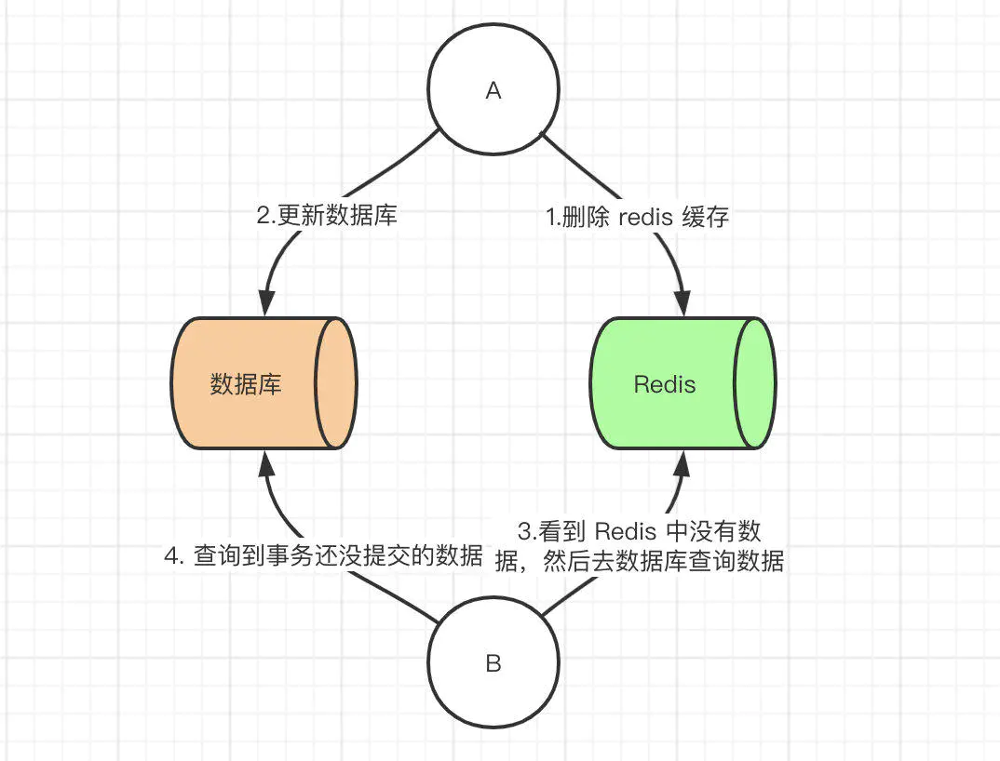
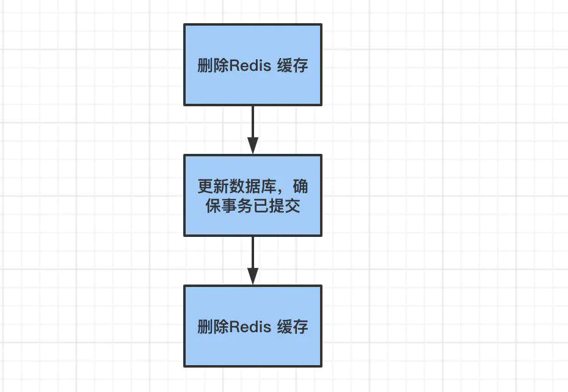
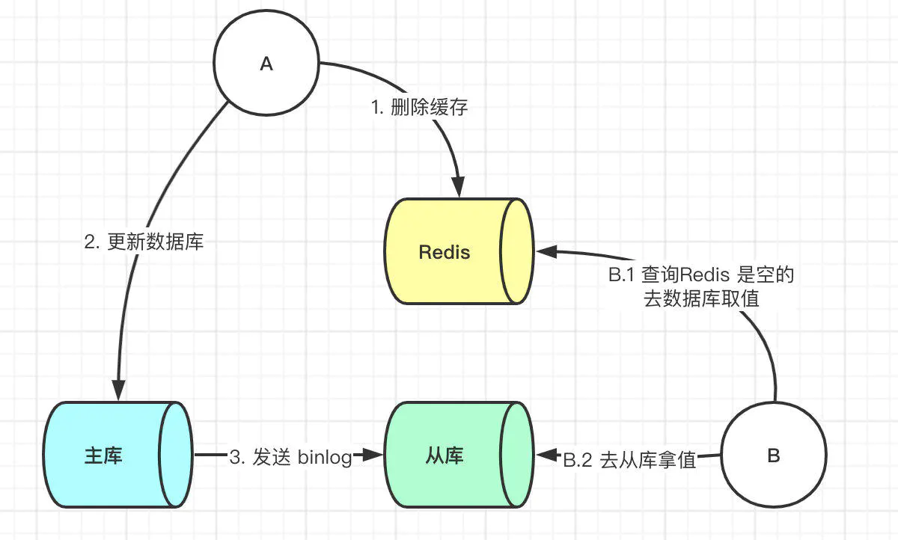
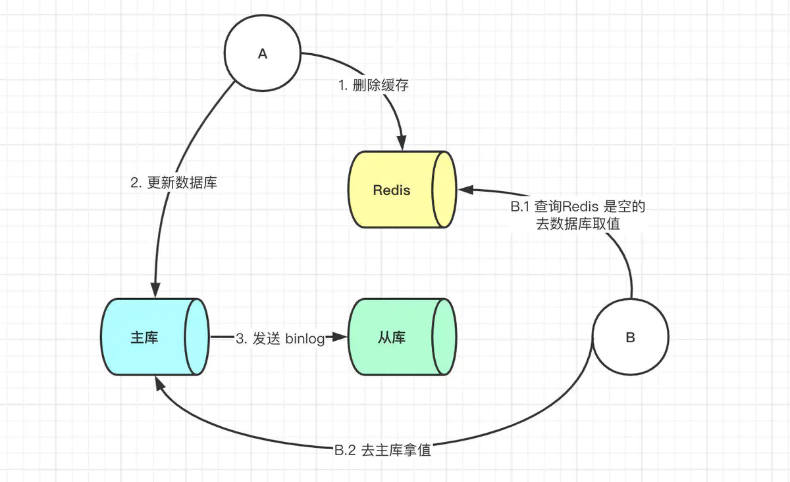

# redis 常见问题

## redis 学习路线

## redis问题画像

## redis为什么那么快？

>完全基于内存的操作，可以减少读取磁盘的消耗  
>单进程的，可以避免多线程切换问题和并发控制问题  
>非阻塞IO：redis采用epoll作为IO多路复用的事件模型，可以减少IO上的损耗  
>Redis采用一些常见的高效索引结构作为某些value类型的底层数据结构，这一技术路线为Redis实现高性能访问提供了良好的支撑。

## redis有时访问慢的原因

>哈希冲突  
>正在进行rehash  

## redis的数据类型有哪几种，使用了那种？是怎么使用的？

string/hash/list/set/zset

## string类型的底层数据结构是怎么样的？

 [redis_struct](./Struct.md)

## 删除数据内存占用还是很高?

>内存分配策略局限性，一般都会分配固定的空间大小，导致实际分配的内存空间大于实际申请的，从而多出了许多不连续的空闲内存块。  
>键值对的修改、删除导致了内存的扩容或者释放，导致多余的不连续的空闲内存块。  

### 解决方案

**方案一**
重启redis（需要考虑是否进行了数据持久化）

**方案二**
要求redis>4.0  
设置自动清理  
config set activedefrag yes  

### 参考

[为什么删除数据后，Redis内存占用依然很高？](https://www.oschina.net/group/database#/detail/2371060)

## redis的分布式锁用过吗？，怎么用的？

[分布式锁](.DistributedLock.md)

## redis是怎么实现原子性的?

edis在处理客户端的请求时，包括获取 (socket 读)、解析、执行、内容返回 (socket 写) 等都由一个顺序串行的主线程处理，这就是所谓的“单线程”。  
对于Redis而言，命令的原子性指的是：一个操作的不可以再分，操作要么执行，要么不执行。  
执行get、set以及eval等API，都是一个一个的任务，这些任务都会由Redis的线程去负责执行，任务要么执行成功，要么执行失败，这就是Redis的命令是原子性的原因。  
Redis本身提供的所有API都是原子操作，Redis中的事务其实是要保证批量操作的原子性。

## redis为什么要用单线程？

1、实现简单，不用考虑处理资源的竞争  
2、减少多线程上下文切换的消耗  

因为Redis是基于内存的操作，CPU不是Redis的瓶颈，Redis的瓶颈最有可能是机器内存的大小或者网络带宽；既然单线程容易实现，而且CPU不会成为瓶颈，那就顺理成章地采用单线程的方案了。

### redis 单线程的优劣势

#### 优势

1、代码清晰，处理逻辑更简单  
2、不用考虑因为多线程导致得各种锁得问题  
3、不存在多进程或者多线程导致的切换而消耗CPU

#### 劣势

无法发挥多核CPU性能，不过可以通过在单机开多个Redis实例来完善；

[Redis为什么是单线程，高并发快的3大原因详解](https://zhuanlan.zhihu.com/p/58038188)

## Redis单线程处理IO请求性能瓶颈主有哪些?

1、任意一个请求在server中一旦发生耗时，都会影响整个server的性能，也就是说后面的请求都要等前面这个耗时请求处理完成；  
2、并发量非常大时，单线程读写客户端IO数据存在性能瓶颈，虽然采用IO多路复用机制，但是读写客户端数据依旧是同步IO，只能单线程依次读取客户端的数据，无法利用到CPU多核。

## redis6.0 为什么引入多线程？

1、可以充分利用服务器CPU资源，目前主线程只能利用一个核  
2、多线程任务可以分摊Redis同步IO读写负荷

## 最新的redis6.0用了多线程，是怎么实现的？

redis的多线程主要是针对IO进行了多线程，来提高redis针对IO上的性能  
[Redis 6.0 新特性-多线程连环13问！](https://www.cnblogs.com/madashu/p/12832766.html)

## Redis6.0与Memcached多线程模型对比

相同点：都采用了master线程worker线程的模型  
不同点：Memcached执行主逻辑也是在worker线程里，模型更加简单，实现了真正的线程隔离，符合我们对线程隔离的常规理解；而Redis把处理逻辑交还给master线程，虽然一定程度上增加了模型复杂度，但也解决了线程并发安全等问题。

## redis与memcached的区别

|redis|memcached|
|-----|-----|
| 支持多种数据类型| 只支持string类型|
| redis6.0之前是单进程的| 是多进程的|
| 支持持久化| 不支持|
|支持数据备份| 不支持|

## 整数数组和压缩列表在查找时间复杂度方面并没有很大的优势，那为什么Redis还会把它们作为底层数据结构呢？

1、内存利用率，数组和压缩列表都是非常紧凑的数据结构，它比链表占用的内存要更少。Redis是内存数据库，大量数据存到内存中，此时需要做尽可能的优化，提高内存的利用率。

2、数组对CPU高速缓存支持更友好，所以Redis在设计时，集合数据元素较少情况下，默认采用内存紧凑排列的方式存储，同时利用CPU高速缓存不会降低访问速度。当数据元素超过设定阈值后，避免查询时间复杂度太高，转为哈希和跳表数据结构存储，保证查询效率。

## 事件模型

## reids基本IO模型

## 备份

[AOF和RDB](./backups.md)

## 集群

[主从库](./master_slave.md)

## redis 特点

1、支持丰富的数据类型（string/list/hash/set/zset）  
2、支持持久化(aof/rdb)  
3、支持主从模式和哨兵机制的高可用  
4、内存过载时的淘汰算法  
5、支持集群和分片的横向扩展  

## redis一般会创建哪些子进程？

1、创建RDB的后台子进程(bgsave)，同时由它负责在主从同步时传输RDB给从库  
2、主从通过无盘复制方式传输RDB的子进程  
3、bgrewriteaof子进程（重写AOF）。

## 集合统计模式

聚合统计、排序统计、二值状态统计、基数统计

## redis缓存和本地缓存是怎么配合使用的，数据的一致性是如何解决的？

缓存和数据库双写时的数据一致性。

### 数据一致性的解决方案

先更新数据库，后更新缓存  
先更新缓存，后更新数据库  
先更新数据库，后删除缓存  
先删除缓存，后更新数据库  

### 先删除缓存，后更新数据库  

该方案也会出问题，具体出现的原因如下。

此时来了两个请求，请求A（更新操作）和请求B（查询操作）  
1、请求A会先删除Redis中的数据，然后去数据库进行更新操作  
2、此时请求B看到redis中的数据是空的，回去数据库中查询该值，补录到redis中  
3、但是此时请求A并没没有更i性能成功，或者事务还未提交  

问题一：以上情况就可能出现数据库和redis数据不一致问题，一般解决方案就是双删的策略

问题二：上述保证事务提交完以后再进行删除缓存还有一个问题，就是如果你使用的是Mysql 的读写分离的架构的话，那么其实主从同步之间也会有时间差。

此时来了两个请求，请求A(更新操作)和请求B（查询操作）  
1、请求A更新操作，删除了Redis  
2、请求主库进行更新操作，主库与从库进行同步数的操作  
3、请求B查询操作，发现redis中没有数据  
4、去从库中请求数据  
5、此时同步数据还未完成，拿到的数据是旧数据  

此时的解决办法就是如果是对 Redis 进行填充数据的查询数据库操作，那么就强制将其指向主库进行查询。

## redis的优缺点

### redis优点

1、读写性能优异，单台redis读的性能10W/s 单台redis写的性能8W/s  
2、支持持久化，支持RDB、AOF两种方式  
3、支持事务、redis的所有操作都是原子性的，同时还支持对几个操作合并后的原子性操作  
4、数据结构丰富，支持string、hash、list、set、zset等  
5、支持主从复制、集群等  

### redis缺点

1、数据库容量受物理内存的限制，不能用过海量数据的高性能读写；
2、redis不具备自动容错和恢复功能；  
3、主机宕机，宕机前部分数据未能及时同步到从机，切换IP后会引入数据不一致问题，降低了系统的可用性；  

### 本地缓存和分布式缓存的区别？

1、本地缓存一般仅存在当前线程，无法共享  
2、redis作为分布式缓存，可以使所有线程共享  

## redis持久化

持久化就是把内存的数据写到磁盘中去，防止服务宕机了内存数据丢失。

### redis持久化机制

Redis提供两种持久化机制RDB（默认）和AOF机制:  
当两种方式同时开启时，数据恢复Redis会优先选择AOF恢复。

### RDB的特点

RDB是Redis默认的持久化方式；按照一定的时间将内存的数据以快照的形式保存到硬盘中，对应产生的数据文件为dump.rdb；通过配置文件中的save参数来定义快照的周期。  
优点：  
1、只有一个dump.rdb文件，方便持久化  
2、容灾性好，一个文件可以保存到安全的磁盘  
3、能最大化，fork子进程来完成写操作，让主进程继续处理命令，所以是IO最大化；使用单独子进程来进行持久化，主进程不会进行任何IO操作，保证了redis的高性能  
4、相对于数据容量大时，比AOF的启动效率更高  

缺点：
1、数据安全性低

### AOF的特点

AOF持久化(即Append Only File持久化)，则是将Redis执行的每次写命令记录到单独的日志文件中，当重启Redis会重新将持久化的日志中文件恢复数据。

优点：  
1、数据安全

缺点：  
1、AOF文件比RDB文件大，且恢复速度慢  
2、数据容量大时，比RDB启动效率低  

### AOF与RDB对比

1、AOF文件比RDB更新频率高，优先使用AOF还原数据。  
2、AOF比RDB更安全也更大  
3、RDB性能比AOF好  
4、如果两个都配了优先加载AOF  

### Redis持久化数据和缓存怎么做扩容？

1、如果Redis被当做缓存使用，使用一致性哈希实现动态扩容缩容。  
2、如果Redis被当做一个持久化存储使用，必须使用固定的keys-to-nodes映射关系，节点的数量一旦确定不能变化。否则的话(即Redis节点需要动态变化的情况），必须使用可以在运行时进行数据再平衡的一套系统，而当前只有Redis集群可以做到这样。

## Redis的过期键的删除策略

### 定时过期

每个设置过期时间的key都需要创建一个定时器，到过期时间就会立即清除。该策略可以立即清除过期的数据，对内存很友好；但是会占用大量的CPU资源去处理过期的数据，从而影响缓存的响应时间和吞吐量。

### 惰性过期

只有当访问一个key时，才会判断该key是否已过期，过期则清除。该策略可以最大化地节省CPU资源，却对内存非常不友好。极端情况可能出现大量的过期key没有再次被访问，从而不会被清除，占用大量内存。

### 定期过期

每隔一定的时间，会扫描一定数量的数据库的expires字典中一定数量的key，并清除其中已过期的key。该策略是前两者的一个折中方案。通过调整定时扫描的时间间隔和每次扫描的限定耗时，可以在不同情况下使得CPU和内存资源达到最优的平衡效果。
(expires字典会保存所有设置了过期时间的key的过期时间数据，其中，key是指向键空间中的某个键的指针，value是该键的毫秒精度的UNIX时间戳表示的过期时间。键空间是指该Redis集群中保存的所有键。)

## redis支持的淘汰策略

|算法|说明|
|-----|-----|
|allkeys-lru|不管key是否设置了过期，淘汰最近最少访问的key|
|volatile-lru|只淘汰最近最少访问、并设置了过期时间的key|
|allkeys-random|不管key是否设置了过期，随机淘汰key|
|volatile-random|只随机淘汰设置了过期时间的key|
|allkeys-ttl|不管key是否设置了过期，淘汰即将过期的key|
|noeviction|不淘汰任何key，实例内存达到maxmeory后，再写入新数据直接返回错误|
|allkeys-lfu|不管key是否设置了过期，淘汰访问频率最低的key（4.0+版本支持）|
|volatile-lfu|只淘汰访问频率最低、并设置了过期时间 key（4.0+版本支持）|

## 缓存雪崩

缓存雪崩是指缓存同一时间大面积的失效，所以，后面的请求都会落到数据库上，造成数据库短时间内承受大量请求而崩掉。  

1、缓存数据的过期时间设置随机，防止同一时间大量数据过期现象发生。  
2、一般并发量不是特别多的时候，使用最多的解决方案是加锁排队。  
3、给每一个缓存数据增加相应的缓存标记，记录缓存的是否失效，如果缓存标记失效，则更新数据缓存。  

## 缓存穿透

缓存穿透是指缓存和数据库中都没有的数据，导致所有的请求都落到数据库上，造成数据库短时间内承受大量请求而崩掉。

1、接口层增加校验，如用户鉴权校验，id做基础校验，id<=0的直接拦截；  
2、从缓存取不到的数据，在数据库中也没有取到，这时也可以将key-value对写为key-null，缓存有效时间可以设置短点，如30秒（设置太长会导致正常情况也没法使用）。这样可以防止攻击用户反复用同一个id暴力攻击。  
3、采用布隆过滤器，将所有可能存在的数据哈希到一个足够大的 bitmap 中，一个一定不存在的数据会被这个 bitmap 拦截掉，从而避免了对底层存储系统的查询压力。  

## 缓存击穿

缓存击穿是指缓存中没有但数据库中有的数据（一般是缓存时间到期），这时由于并发用户特别多，同时读缓存没读到数据，又同时去数据库去取数据，引起数据库压力瞬间增大，造成过大压力。和缓存雪崩不同的是，缓存击穿指并发查同一条数据，缓存雪崩是不同数据都过期了，很多数据都查不到从而查数据库。  

解决方案：  
1、设置热点数据永远不过期。  
2、加互斥锁，互斥锁  

## 缓存预热

缓存预热就是系统上线后，将相关的缓存数据直接加载到缓存系统。这样就可以避免在用户请求的时候，先查询数据库，然后再将数据缓存的问题！用户直接查询事先被预热的缓存数据。

解决方案：  
1、直接写个缓存刷新页面，上线时手工操作一下；  
2、数据量不大，可以在项目启动的时候自动进行加载；  
3、定时刷新缓存；  

## 缓存降级

## redis参考

[redis中文社区文档](http://www.redis.cn/documentation.html)
[Redis 常见面试题（2020最新版）](https://www.cnblogs.com/javazhiyin/p/13839357.html)
