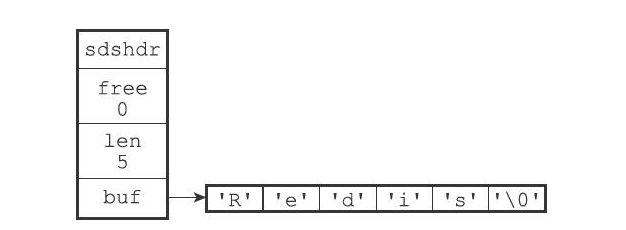
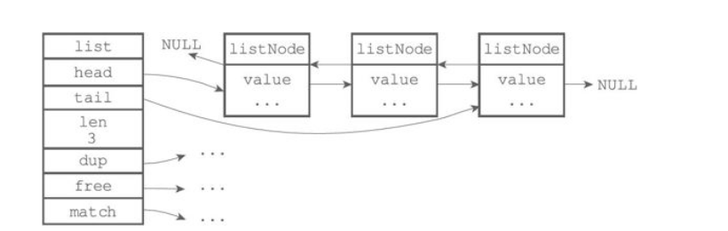
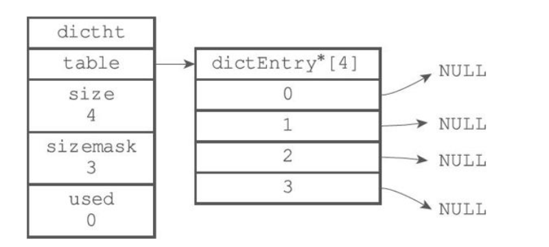
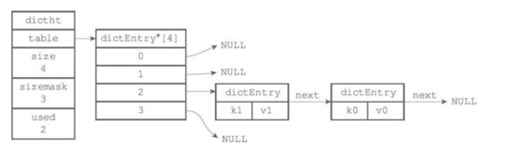
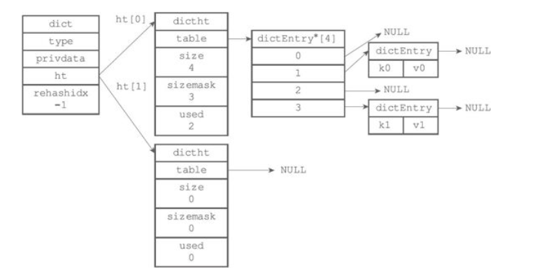
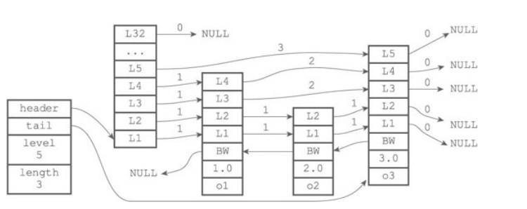

# redis底层数据结构

redis的底层数据结构包含简单的动态字符串（SDS）、链表、字典、跳跃表、压缩列表、整数集合；  
常用的数据类型都是由一种或几种数据结构构成；命令行使用“object encoding key”可以查看key的数据结构。

## 一、简单的动态字符串（simple dynamic string）

```redis
struct sdshdr {
    // buf中已占用空间的长度
    int len;
    // buf中剩余可用空间的长度
    int free;
    // 数组空间
    char buf[];
}
```



### C字符串和SDS之间的区别

| C字符串 | SDS |
| --------- | ------------------ |
| 获取字符串复杂度为O(n) | SDS获取字符串长度复杂度为O(1) |
| API是不安全的，可能造成缓冲区溢出| API是安全的，不会造成缓冲区溢出|
| 修改字符串长度N次必然需要执行N次内存重新分配| 修改字符串长度N次最多需要执行N次内存重新分配|
|只能保存文本数据|可以保存文本或者二进制数据|
|可以使用所有<stirng.h>库中的函数|可以使用部分<stirng.h>库中的函数|

### 字符串总结

Redis只会使用C字符串作为字面量，在大多数情况下，Redis使用SDS（Simple Dynamic String，简单动态字符串）作为字符串表示。

## 二、链表

redis使用C语言编写，但是并没有内置链表这种数据结构，而是自己构建了链表的实现，构成链表结构的节点为链表节点；  

### 链表节点

```redis
typeof struct listNode {
    // 前置节点
    struct listNode *prev;
    // 后置节点
    struct listNode *next;
    // 节点值
    void *value;
}listNode;
```

### 链表结构

多个listNode通过前后指针构成双端链表

```redis
typedof struct list{
    // 表头节点
    listNode *head;
    // 表尾节点
    listNode *tail;
    // 链表所包含的节点数量
    unsigned long len;
    // 节点值复制函数
    void *(*dup)(void *ptr)
    // 节点释放函数
    void (*free)(void *ptr)
    // 节点值对比函数
    int (*match)(void *ptr, void *key)
}list;
```



### redis链表实现的特性

>双端：链表节点带有prev和next指针，获取某个节点的前置节点和后置节点的复杂度都是O(1)。  
>无环：表头节点的prev指针和表尾节点的next指针都指向NULL，对链表的访问以NULL为终点。  
>带表头指针和表尾指针：通过list结构的head指针和tail指针，程序获取链表的表头节点和表尾节点的复杂度为O(1)。  
>带链表长度计数器：程序使用list结构的len属性来对list持有的链表节点进行计数，程序获取链表中节点数量的复杂度为O(1)。  
>多态：链表节点使用void*指针来保存节点值，并且可以通过list结构的dup、free、match三个属性为节点值设置类型特定函数，所以链表可以用于保存各种不同类型的值。  

### 链表应用范围

链表的应用范围：列表、发布与订阅、慢查询、监视器等。

## 三、字典

字典，又称为符号表（symbol table）、关联数组（associativearray）或映射（map），是一种用于保存键值对（key-value pair）的抽象数据结构。  

Redis使用的C语言没有内置这种结构，所以Redis构建了自己的字典实现。  

Redis的字典使用哈希表作为底层实现，一个哈希表里面可以有多个哈希表节点，而每个哈希表节点就保存了字典中的一个键值对。

### 哈希表

```redis
typedef struct dictht {
    // 哈希表数组
    dictEntry **table;
    // 哈希表大小
    unsigned long size;
    // 哈希表大小掩码，用于计算索引值
    // 总是等于size-1
    unsigned long sizemask;
    // 该哈希表已有节点的数量
    unsigned long used;
} dictht;
```


图中是一个大小为4的空哈希表  
table是一个数组，数组元素是dictEntry结构的指针，每个dictEntry保存一个键值对  
size 记录哈希表的大小  
sizemask 值总是等于size-1，这个属性和哈希值一起决定一个键应该被方法table数组的哪个索引上  
used 记录哈希表目前已有节点的数量  

### 哈希表节点

```redis
typedef struct dictEntry {
    // 键 key属性保存着键值对中的键
    void *key;
    // 值 保存着键值对中的值
    // 键值对中的值可以使指针val、一个uint64_t整数，或是一个int64_t整数
    union{
        void *val;
        uint64_tu64;
        int64_ts64;
    } v;
    // 指向下个哈希表节点，形成链表
    struct dictEntry *next;
} dictEntry;
```



### 字典结构

```redis
typedef struct dict {
    // 类型特定函数
    dictType *type;
    // 私有数据
    void *privdata;
    // 哈希表
    dictht ht[2];
    // rehash索引
    //当rehash不在进行时，值为-1
    in trehashidx; /* rehashing not in progress if rehashidx == -1 */
} dict;

typedef struct dictType {
    // 计算哈希值的函数
    unsigned int (*hashFunction)(const void *key);
    // 复制键的函数
    void *(*keyDup)(void *privdata, const void *key);
    // 复制值的函数
    void *(*valDup)(void *privdata, const void *obj);
    // 对比键的函数
    int (*keyCompare)(void *privdata, const void *key1, const void *key2);
    // 销毁键的函数
    void (*keyDestructor)(void *privdata, void *key);
    // 销毁值的函数
    void (*valDestructor)(void *privdata, void *obj);
} dictType;
```



### 函数

#### 哈希算法

添加键值对时，首先要根据键值对的键计算出哈希值和索引值，然后再根据索引值进行放入

#### 解决键冲突

当有两个或以上数量的键值被分配到了哈希表数组的同一个索引上时，就发生了键冲突  
Redis的哈希表使用单向链表解决键冲突问题，每个新的键总是添加到单项链表的表头。

#### rehash（扩展或收缩）

哈希表具有负载因子（load factor），其始终需要保持在一个合理的范围之内，当hashI表保存的键值对过多或过少时，就需要对哈希表进行rehash（重新散列）操作，步骤许下

(1) 为字典的ht[1]分配空间。

(2) 将ht[0]内的数据重新计算哈希值和索引，并放到新分配的ht[1]空间上。

(3) 全部迁移完成后，释放ht[0]，将ht[1]设置为ht[0]，并创建一个空白的哈希表为ht[1]，为下次rehash做准备。

### 哈希表的扩展与收缩触发条件

(1) 服务器目前没有在执行BGSAVE命令或者BGREWRITEAOF命令，并且哈希表的负载因子大于等于1。  
(2) 服务器目前正在执行BGSAVE命令或者BGREWRITEAOF命令，并且哈希表的负载因子大于等于5。

### 字典应用范围

字典在Redis中的应用相当广泛，比如Redis的数据库就是使用字典来作为底层实现的，对数据库的增、删、查、改操作也是构建在对字典的操作之上的。  

### 字典总结

>字典被广泛用于实现Redis的各种功能，其中包括数据库和哈希键。  
>Redis中的字典使用哈希表作为底层实现，每个字典带有两个哈希表，一个平时使用，另一个仅在进行rehash时使用。  
>当字典被用作数据库的底层实现，或者哈希键的底层实现时，Redis使用MurmurHash2算法来计算键的哈希值。  
>哈希表使用链地址法来解决键冲突，被分配到同一个索引上的多个键值对会连接成一个单向链表。  
>在对哈希表进行扩展或者收缩操作时，程序需要将现有哈希表包含的所有键值对rehash到新哈希表里面，并且这个rehash过程并不是一次性地完成的，而是渐进式地完成的。

## 四、跳跃表

跳跃表（skiplist）是一种有序数据结构，它通过在每个节点中维持多个指向其他节点的指针，从而达到快速访问节点的目的。

### 跳跃表的节点

zskiplistNode结构用于表示跳跃表节点

```redis
typedef struct zskiplistNode {
    // 层
    struct zskiplistLevel {
        // 前进指针
        struct zskiplistNode *forward;
        // 跨度
        unsigned int span;
    } level[];
    // 后退指针
    struct zskiplistNode *backward;
    // 分值
    double score;
    // 成员对象
    robj *obj;
} zskiplistNode;
```

层：为一个数组，数组中的每个数据都包含前进指针和跨度。  
前进指针：指向表尾方向的其他节点的指针，用于从表头方向到表尾方向快速访问节点。  
跨度：记录两个节点之间的距离，跨度越大，两个节点相聚越远，所有指向NULL的前进指针的跨度都为0。  
后退指针：用于从表尾节点向表头节点访问，每个节点都有后退指针，并且每次只能后退一个节点。  
分值：节点的分值是一个double类型的浮点数，跳跃表中的说有分值按从小到大排列。  
成员对象：是一个指向字符串的指针，字符串则保存着一个SDS值。  

### 跳跃表(skiplist)

zskiplist结构则用于保存跳跃表节点的相关信息，比如节点的数量，以及指向表头节点和表尾节点的指针等等。

```redis
typedef struct zskiplist {
    // 表头节点和表尾节点
    structz skiplistNode *header, *tail;
    // 表中节点的数量
    unsigned long length;
    // 表中层数最大的节点的层数
    int level;
} zskiplist;
```



上图展示了一个跳跃表示例，位于图片最左边的是zskiplist结构，该结构包含以下属性：  
header：指向跳跃表的表头节点。  
tail：指向跳跃表的表尾节点。  
level：记录目前跳跃表内，层数最大的那个节点的层数（表头节点的层数不计算在内）。  length：记录跳跃表的长度，也即是，跳跃表目前包含节点的数量（表头节点不计算在内）。  

### 跳跃表应用范围

Redis只在两个地方用到了跳跃表，一个是实现有序集合键，另一个是在集群节点中用作内部数据结构，除此之外，跳跃表在Redis里面没有其他用途。

### 跳跃表总结

>跳跃表是有序集合的底层实现之一。  
>Redis的跳跃表实现由zskiplist和zskiplistNode两个结构组成，其中zskiplist用于保存跳跃表信息（比如表头节点、表尾节点、长度），而zskiplistNode则用于表示跳跃表节点。  
>每个跳跃表节点的层高都是1至32之间的随机数。  
>在同一个跳跃表中，多个节点可以包含相同的分值，但每个节点的成员对象必须是唯一的。  
>跳跃表中的节点按照分值大小进行排序，当分值相同时，节点按照成员对象的大小进行排序。

## 五、整数集合

整数集合（intset）是集合键的底层实现之一，当一个集合只包含整数元素，并且元素的个数不多时，Redis就会使用整数集合作为集合键的底层实现。

整数集合（intset）是Redis用于保存整数值的集合抽象数据结构，它可以保存类型为int16_t、int32_t或者int64_t的整数值，并且保证集合中不会出现重复元素。

```redis

typedef struct intset {
    // 编码方式
    uint32_t encoding;
    // 集合包含的元素数量
    uint32_t length;
    // 保存元素的数组
    int8_t contents[];
} intset;
```

contents数组存储的是集合中的每个元素，他的类型是int8_t，但存储数据的实际类型取决于编码方式encoding  
encoding编码方式有三种INTSET_ENC_INT16、INTSET_ENC_INT32、INTSET_ENC_INT64分别对应的是int16_t、int32_t、int64_t类型  
length记录整数集合的元素数量，即contents数组的长度

### 整数集合的升级操作

整数集合中原来保存的是小类型（如：int16_t）的整数，当插入比其类型大（如：int_64_t）的整数时，会把整合集合里的元素的数据类型都转换成大的类型，这个过程称为升级

升级整数集合并添加新元素步骤如下：  
1、根据新元素的类型，扩展整数集合的底层数据的空间大小，并为新元素分配空间。  
2、将现有的所有元素的类型转换成与新元素相同的类型，保持原有数据有序性不变的情况下，把转换后的元素放在正确的位置上。  
3、将新元素添加到数组里。  

### 升级之后新元素的摆放位置

因为引发升级的新元素的长度总是比整数集合现有所有元素的长度都大，所以这个新元素的值要么就大于所有现有元素，要么就小于所有现有元素：  
在新元素小于所有现有元素的情况下，新元素会被放置在底层数组的最开头（索引0）；  
在新元素大于所有现有元素的情况下，新元素会被放置在底层数组的最末尾（索引length-1）。  

### 升级的好处

整数集合的升级策略有两个好处，一个是提升整数集合的灵活性，另一个是尽可能地节约内存。

### 整数集合的应用范围

一般用来实现集合

### 整数集合总结

>整数集合是集合键的底层实现之一。  
整数集合的底层实现为数组，这个数组以有序、无重复的方式保存集合元素，在有需要时，程序会根据新添加元素的类型，改变这个数组的类型。  
升级操作为整数集合带来了操作上的灵活性，并且尽可能地节约了内存。  
整数集合只支持升级操作，不支持降级操作。

## 六、压缩列表

压缩列表是Redis为了节约内存而开发的，是由一系列特殊编码的连续内存块组成的顺序型（sequential）数据结构。一个压缩列表可以包含任意多个节点（entry），每个节点可以保存一个字节数组或者一个整数值。

### 压缩列表的引用范围

压缩列表（ziplist）是列表键和哈希键的底层实现之一

### 压缩列表总结

>压缩列表是一种为节约内存而开发的顺序型数据结构。  
>压缩列表被用作列表键和哈希键的底层实现之一。  
>压缩列表可以包含多个节点，每个节点可以保存一个字节数组或者整数值。  
>添加新节点到压缩列表，或者从压缩列表中删除节点，可能会引发连锁更新操作，但这种操作出现的几率并不高。

## 数据类型和底层数据结构的对应关系


## 底层数据结构操作的时间复杂度


## 参考

[Redis的底层数据结构](https://www.cnblogs.com/MouseDong/p/11133941.html)  
[Redis设计与实现](https://book.douban.com/subject/25900156/)
