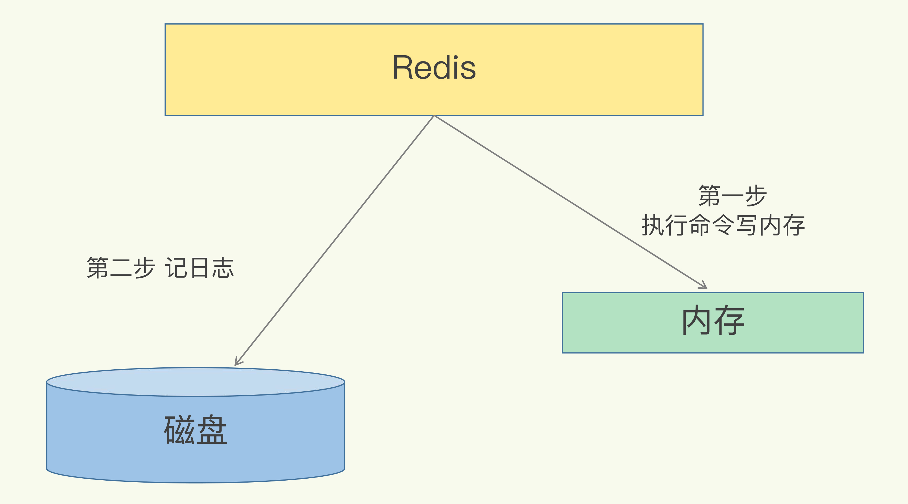

# 备份

## AOF日志

### AOF操作过程



### AOF写入流程

1、不会对命令进行语法检查  
2、只记录执行成功的命令  
3、执行完命令之后再记录日志，不会阻塞当前的写操作

#### 优点

1、可以避免出现记录错误命令的情况。  
2、不会阻塞当前的写操作。

#### 风险

1、执行完命令之后服务宕机，则AOF日志没有写入，如果使用redis做数据库，则在使用AOF恢复时候，因为日志没有记录上，则无法恢复。  
2、AOF虽然避免了对当前命令的阻塞，但是可能对下一个命令带来阻塞风险。

### 三种回写策略

Always，同步写回：每个写命令执行完，立马同步地将日志写回磁盘；  
Everysec，每秒写回：每个写命令执行完，只是先把日志写到AOF文件的内存缓冲区，每隔一秒把缓冲区中的内容写入磁盘；  
No，操作系统控制的写回：每个写命令执行完，只是先把日志写到AOF文件的内存缓冲区，由操作系统决定何时将缓冲区内容写回磁盘。

|配置项|写回时机|优点|缺点|
|-----|-----|-----|-----|
|Always|同步写回|可靠性高，不会丢失|每个命令都要落盘，性能影响较大|
|Everysec|每秒写回|性能适中|宕机会丢失一秒数据|
|No|操作系统控制写回|性能好|宕机丢失数据多|

### AOF日志太大怎么办？

AOF重写机制就是在重写时，Redis根据数据库的现状创建一个新的AOF文件，也就是说，读取数据库中的所有键值对，然后对每一个键值对用一条命令记录它的写入。

### AOF重写会阻塞吗？

和AOF日志由主线程写回不同，重写过程是由后台子进程bgrewriteaof来完成的，这也是为了避免阻塞主线程，导致数据库性能下降。

### 重写时如何保证新增的操作日志不会丢失？

每次AOF重写时，Redis会先执行一个内存拷贝，用于重写；然后，使用两个日志保证在重写过程中，新写入的数据不会丢失。而且，因为 Redis 采用额外的线程进行数据重写，所以，这个过程并不会阻塞主线程。


### AOF 日志重写的时候，是由 bgrewriteaof子进程来完成的，不用主线程参与，我们今天说的非阻塞也是指子进程的执行不阻塞主线程。但是你觉得，这个重写过程有没有其他潜在的阻塞风险呢？如果有的话，会在哪里阻塞？

一般会存在两点，一个是fork子进程时，另一个是子进程重写时有新的写入、修改操作会导致子进程和主线程共享内存  

1、主线程 fork 创建 bgrewriteaof 子进程时，内核需要创建用于管理子进程的相关数据结构，这些数据结构在操作系统中通常叫作进程控制块（Process Control Block，简称为 PCB）。内核要把主线程的 PCB 内容拷贝给子进程。这个创建和拷贝过程由内核执行，是会阻塞主线程的。而且，在拷贝过程中，子进程要拷贝父进程的页表，这个过程的耗时和Redis实例的内存大小有关。如果 Redis 实例内存大，页表就会大，fork 执行时间就会长，这就会给主线程带来阻塞风险。  
2、bgrewriteaof 子进程会和主线程共享内存。当主线程收到新写或修改的操作时，主线程会申请新的内存空间，用来保存新写或修改的数据，如果操作的是 bigkey，也就是数据量大的集合类型数据，那么，主线程会因为申请大空间而面临阻塞风险。因为操作系统在分配内存空间时，有查找和锁的开销，这就会导致阻塞。

### AOF重写也有一个重写日志，为什么它不共享使用AOF本身的日志呢？

1、父子进程写同一个文件必然会产生竞争问题，控制竞争就意味着会影响父进程的性能。  
2、如果AOF重写过程中失败了，那么原本的AOF文件相当于被污染了，无法做恢复使用。所以Redis AOF重写一个新文件，重写失败的话，直接删除这个文件就好了，不会对原先的AOF文件产生影响；等重写完成之后，直接替换旧文件即可。

## RDB

内存快照，所谓内存快照，就是指内存中的数据在某一个时刻的状态记录。

### 生成快照的命令

save：在主线程中执行，会导致阻塞；  
bgsave：创建一个子进程，专门用于写入RDB文件，避免了主线程的阻塞，这也是Redis RDB文件生成的默认配置。

### 运行时机？

```redis
save 900 1
save 300 10
save 60 10000
```

### RDB优点

可以快速恢复日志

### RDB缺点

进行快照时相对耗时耗力

## 使用备份建议

数据不能丢失时，内存快照和 AOF 的混合使用是一个很好的选择；  
如果允许分钟级别的数据丢失，可以只使用RDB；  
如果只用 AOF，优先使用 everysec 的配置选项，因为它在可靠性和性能之间取了一个平衡。
