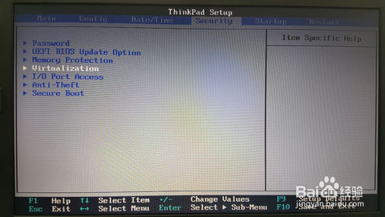
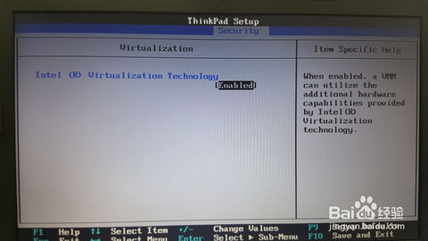
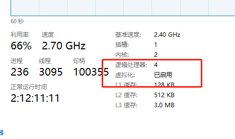
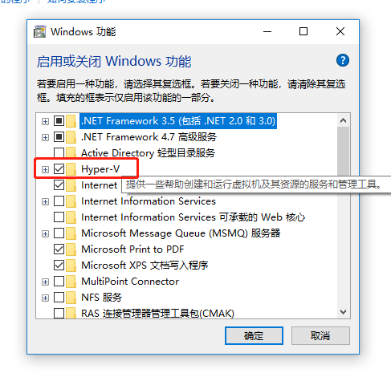

### window本地docker开发环境搭建（hyper-v）

支持hyper-v的系统

###### 开启BIOS的虚拟化
>重启电脑进入BIOS模式（不同电脑进入不一样ThinkPad F1, HP esc+F10）  
找到“Security”下面的“Virtualization”  
将“Intel(R) Virtualization Technology” 设置为“Enabled” 状态

[配置Win10解决VMware Intel VT-x虚拟化问题](https://jingyan.baidu.com/album/4b52d702a3e0aafc5d774b7c.html?picindex=1)

###### 系统hyper-v开启
>打开控制面板  
启动或关闭windows功能  
勾选Hyper-v，然后点击“确认”按钮即可以安装

[使用Hyper-V创建虚拟机](https://www.cnblogs.com/masterwen/p/4230385.html)

###### docker安装

###### 应用环境搭建

### window本地docker开发环境搭建（DockerToolbox）

###### 参考
 - [DockerToolbox在Win7上的安装和设置](https://www.cnblogs.com/canger/p/9028723.html)
